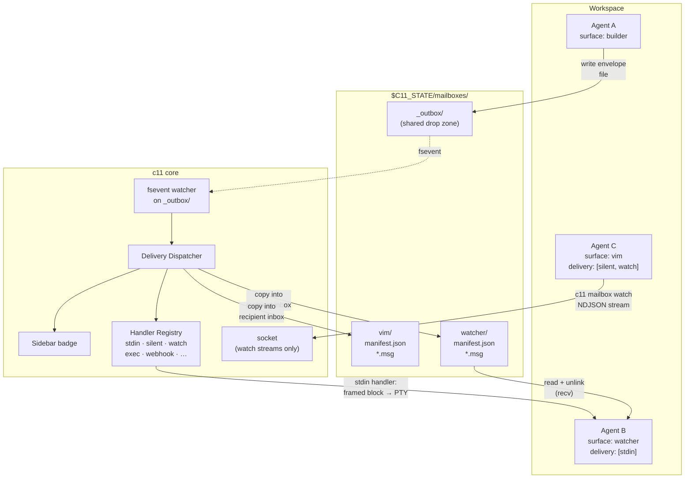
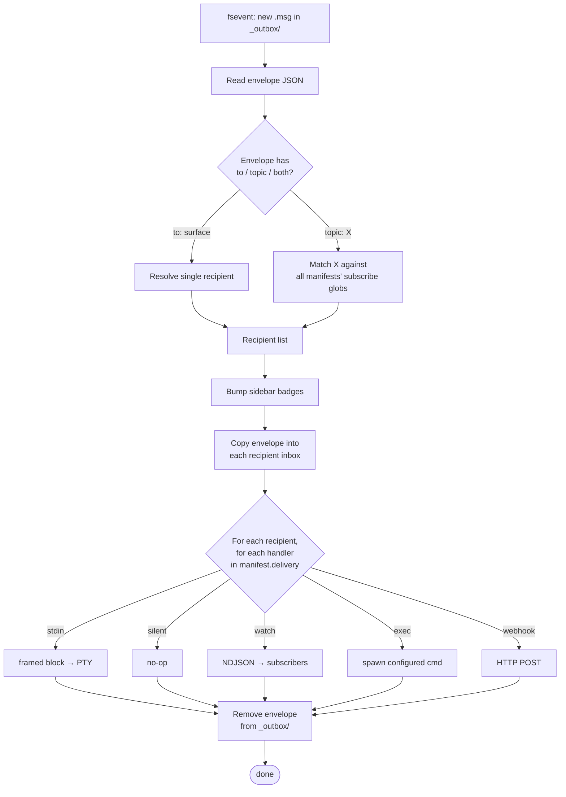
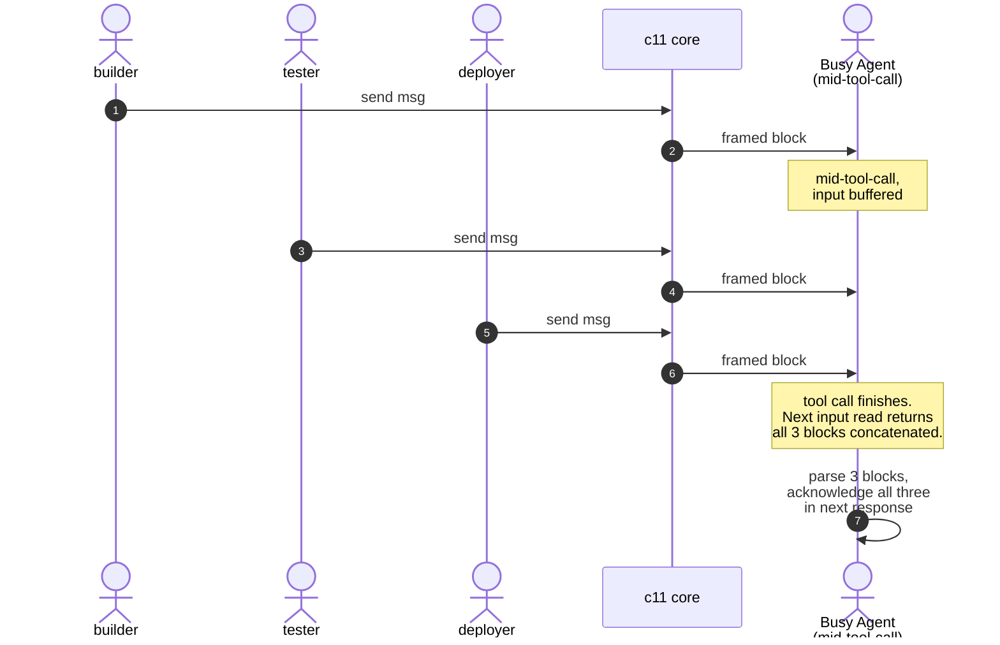
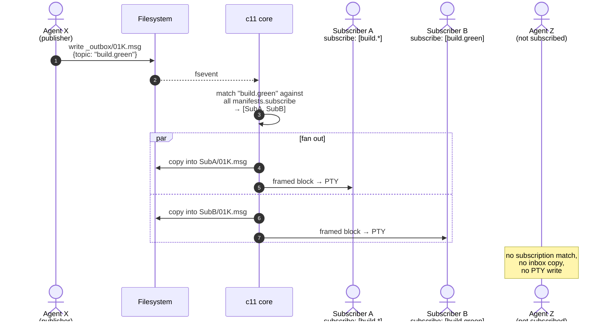
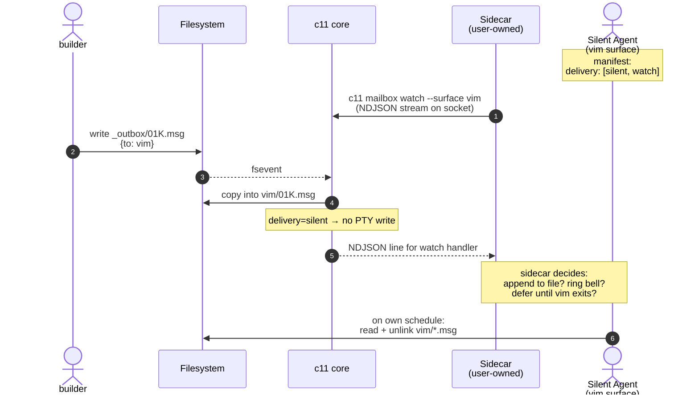
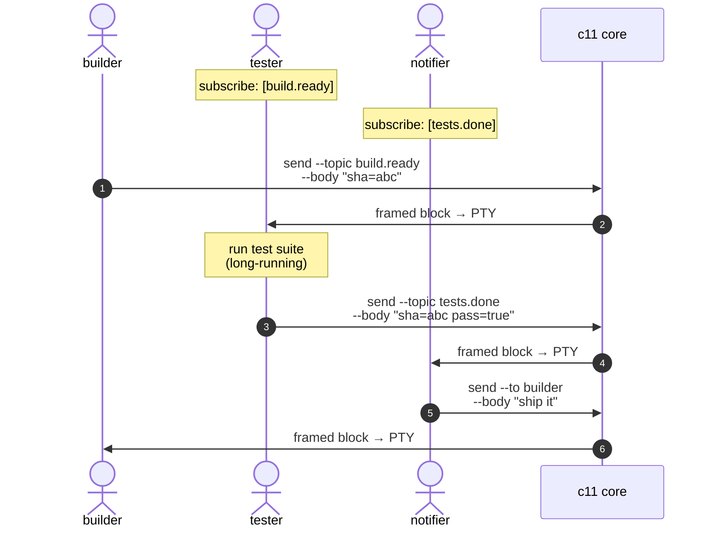

# c11 Inter-Agent Messaging — Design Sketch

**Status:** exploratory. Not a commitment.
**Goal:** the smallest primitive that lets agents running in separate c11 surfaces coordinate, without c11 imposing a protocol.

## Principles at a glance

- **The filesystem is the contract.** Messages live on disk at `$C11_STATE/mailboxes/`. Envelopes are plain JSON files. Any process that can write a file can participate — no SDK required. The directory layout is stable and load-bearing, like `/dev/null` or `$XDG_RUNTIME_DIR`.
- **Two interfaces, one contract.** Agents can write/read envelope files directly, **or** use the `c11 mailbox …` CLI as a thin convenience wrapper. Whatever the CLI can do, a four-line bash script can do. Skill teaches both.
- **Socket is for streams, not content.** `c11 mailbox watch` lives on the c11 socket because a live stream needs a long-lived connection. Send / recv / configure all go through files.
- **Delivery is framed text into the PTY** for stdin-delivery agents; for others, delivery runs through pluggable handlers declared in the recipient's `manifest.json`.
- **The PTY is the queue.** Multiple messages to a busy stdin-delivery recipient stack as multiple `<c11-msg>` blocks in the input buffer. No coalescing state in c11.
- **Grammar is the skill.** `skills/c11/SKILL.md` teaches the XML-tag format, the default protocol, the file layout, and the CLI shortcuts.
- **Receiver-declared, sender-hints.** Each surface's manifest says how it wants messages delivered. Senders can add attributes (`urgent="true"`, …) that handlers may or may not honor.

c11 stays out of the body. Schemas, RPC, workflows, acks — all that lives in developer-land on top of this primitive.

---

## Proposed wire format (for the PTY-framed block)

XML-style tag with attributes. This is the prompt-native structure for LLMs — Claude, Codex, Kimi all handle `<tag attr="value">…</tag>` natively because their own tool-use and system-prompt formats use the same shape. One line of metadata, plain-text body, one closing tag.

```

<c11-msg from="builder" topic="ci-status" id="01K3A2B7X" ts="2026-04-23T10:15:42Z">
build green sha=abc
</c11-msg>

```

- One leading blank line separates the block from any prior output or partial input.
- All metadata lives in attributes on the opening tag. Scales gracefully: add `urgent="true"`, `reply-to="watcher"`, `in-reply-to="01K3ABC"` as needed.
- Body is opaque plain text between the tags.
- One trailing blank line lets multiple blocks stack cleanly.

**Escaping.** If the body contains `<`, `>`, or `&`, c11 applies standard XML escaping on write (`&lt;`, `&gt;`, `&amp;`). Skill tells the agent to unescape on read. Well-understood convention; no new invention.

---

## 1. Architecture at a glance

The core loop is Unix-y: senders write envelopes to a shared outbox directory; c11 watches it via fsevents; on each new envelope, c11 routes into recipient inboxes and fires the configured delivery handlers. The socket only appears for live streams.



**What each piece does**

| Piece | Role |
|---|---|
| `_outbox/` | Shared drop zone. Any process writes envelope files here. No permissions dance; `$C11_STATE` is mode 700 already. |
| Per-surface inboxes | Each surface has `$C11_STATE/mailboxes/<surface>/` containing its `manifest.json` plus pending `.msg` envelopes. Recv = list, read, unlink. |
| fsevent watcher | c11's only send-side role. Watches `_outbox/` for new `.msg` files. |
| Delivery Dispatcher | Reads the envelope, looks up recipient manifest(s) (including topic fan-out), copies the envelope into recipient inboxes, runs each configured handler. Stateless. |
| Handler Registry | Table of handler types. v1: `stdin`, `silent`, `watch`. Designed-for: `exec`, `webhook`, `file-tail`, `signal`. |
| Socket | Used only for long-lived operations: `c11 mailbox watch` streams NDJSON of arrivals. Send / recv / configure do **not** touch the socket. |
| Sidebar badge | Visual salience for the operator. Always fires regardless of delivery mode. |
| CLI | `c11 mailbox send / recv / watch / configure / topics` — thin convenience wrappers over file operations and socket streams. |

---

## 2. Delivery mechanisms — pluggable by design

**Receiver-declared, not sender-imposed.** Each surface chooses how it wants messages delivered by writing a manifest. Senders don't pick the delivery mode; they just hand c11 an envelope. This matches the "unopinionated primitive" principle: c11 provides channels, agents choose which ones suit their runtime.

### The manifest

Each surface has a `manifest.json` in its mailbox directory:

```json
{
  "surface": "watcher",
  "delivery": ["stdin", "watch"],
  "subscribe": ["build.*", "deploy.green"],
  "advertises": [
    { "topic": "watcher.alert", "description": "Fired when CI is red > 10min" }
  ],
  "retention_days": 7,
  "handler_config": {
    "webhook": { "url": "http://localhost:8080/c11-msg" },
    "exec":    { "cmd": "/home/me/.c11-handlers/on-msg.sh" }
  }
}
```

The manifest is a plain file — editable by hand or via CLI:

```
c11 mailbox configure --delivery stdin,watch
c11 mailbox configure --subscribe "build.*"
c11 mailbox configure --advertise watcher.alert --description "Fired when CI is red > 10min"
```

### Handlers that ship in v1

| Handler | What it does | Who it's for |
|---|---|---|
| `stdin` | Writes the `<c11-msg>` framed block to the recipient's PTY. | Default. Any TUI that reads stdin as line-oriented input: Claude Code, Codex, Kimi, plain REPLs. |
| `silent` | No-op beyond the mailbox write. Recipient fetches via `recv` or `watch`. | Full-screen raw-mode TUIs (vim, lazygit). Agents that want zero side effects. |
| `watch` | Pushes an NDJSON line to active `c11 mailbox watch` subscribers on the socket. | Sidecar processes. Silent surfaces paired with an external watcher. Tooling that wants a stream. |

### Handlers that are future-compatible (designed for, not shipped v1)

| Handler | What it would do | Motivating use case |
|---|---|---|
| `exec` | Spawns a user-specified command with the envelope on stdin. | Local glue: append to a log, ring a bell, trigger a notification, kick a build. |
| `webhook` | `POST`s the envelope as JSON to a URL. | Remote workspaces. External services (Slack, Zulip, dashboards). |
| `file-tail` | Appends the framed block to a designated log file. | Agents that can tail a file but shouldn't receive stdin writes. |
| `signal` | Sends a POSIX signal to the surface's process. | Advanced. Pure wake-up with no content; fetch on own. |

### Dispatch flow



Handlers run independently and additively. A surface with `delivery: ["stdin", "watch", "exec"]` gets all three invoked. Failures are logged, not fatal — one bad handler doesn't block the rest.

### Sender-hints, receiver-decides

The sender's only lever is envelope attributes (`urgent="true"`, `priority`, …). Each handler decides how (or whether) to honor them:
- `stdin` handler could prefix urgent messages with an ANSI highlight.
- `exec` handler could pass `--urgent` on the command line.
- `webhook` handler could set a `X-C11-Urgent` header.
- `silent` handler ignores urgency — it has no channel to vary.

**No sender can force-deliver via a channel the recipient didn't opt into.**

---

## 3. Two interfaces — filesystem is the contract, CLI is convenience

Agents have two equivalent ways to send and receive. **The filesystem is authoritative.** The CLI is a thin wrapper that does nothing a shell script and a JSON encoder couldn't.

### Directory layout

```
$C11_STATE/mailboxes/
  _outbox/                        # shared drop zone (everyone writes here)
    01K3A2B7X.tmp                 # in flight
    01K3A2B8Y.msg                 # ready for dispatch
  <surface-handle>/               # per-surface inbox
    manifest.json                 # delivery modes, subscriptions, retention
    01K3A2B9Z.msg                 # pending message
  _topics.json                    # derived topic registry (c11-maintained)
```

### Sending

**As a file write** (any process, any language, no c11 SDK):

```bash
ULID=$(c11 new-ulid)    # or any ULID generator
cat > "$C11_STATE/mailboxes/_outbox/$ULID.tmp" <<EOF
{
  "id": "$ULID",
  "from": "$C11_SURFACE_ID",
  "to": "watcher",
  "topic": "ci-status",
  "ts": "$(date -u +%FT%TZ)",
  "body": "build green sha=abc"
}
EOF
mv "$C11_STATE/mailboxes/_outbox/$ULID.tmp" "$C11_STATE/mailboxes/_outbox/$ULID.msg"
```

The `.tmp → .msg` rename is atomic within a filesystem; c11's fsevent watcher only observes the final `.msg` state. Publishing to a topic uses the same shape — either field (`to`, `topic`, or both) routes independently.

**As a CLI call:**

```
c11 mailbox send --to watcher --topic ci-status --body "build green sha=abc"
```

Equivalent to the above; auto-fills `from`, `ts`, `id`.

### Receiving

**As file reads:**

```bash
for msg in "$C11_STATE/mailboxes/$C11_SURFACE_ID"/*.msg; do
  cat "$msg"   # process
  rm  "$msg"   # or move to a "processed" dir if you want history
done
```

**As a CLI call:**

```
c11 mailbox recv --drain     # prints all pending as NDJSON, unlinks them
c11 mailbox recv --peek      # prints without unlinking
c11 mailbox watch            # streams arrivals on stdout as NDJSON (socket)
```

`watch` is the one operation that requires the socket — a live stream. Everything else is file I/O.

### Configuring

The manifest is a plain file. A text editor works. The CLI wrapper is ergonomics:

```
c11 mailbox configure --delivery stdin,watch
c11 mailbox configure --subscribe "build.*" "deploy.green"
c11 mailbox configure --advertise build.ready --description "CI passed. body = {sha, artifacts_url}"
```

### Why the two-interface approach

- **Scriptability.** Cron jobs, CI steps, one-off bash scripts, agents without c11 SDK bindings — all can participate just by writing a JSON file.
- **Transparency.** The directory is human-inspectable. `ls _outbox/` tells you what's pending. `cat <surface>/manifest.json` tells you that surface's config.
- **Testability.** Integration tests can poke envelopes into `_outbox/` directly, no socket mocking.
- **Stability.** The contract is visible. Breaking it is an obvious change, not a silent CLI rewrite.

The tradeoff: once the file layout is public, the directory structure and envelope schema become load-bearing. That's the correct tradeoff for a primitive — contracts everyone depends on should be stable and visible, not hidden.

### Drift prevention — rules that keep the two interfaces honest

Any system with two ways to do the same thing is at risk of silent divergence. Design rules to prevent that, before implementation:

**1. One envelope-builder library — CLI has no private code path.**
The CLI is implemented by calling the same `build_envelope()` function any SDK or tool would use. Defaults (auto-`id`, auto-`ts`, auto-`from` from `$C11_SURFACE_ID`) live in exactly one place. There is no "CLI knows how to do X that file writers don't" — ever. If a helper is useful from the CLI, it's a library function first.

**2. Validation at dispatch, not at send.**
Whether an envelope arrives via `c11 mailbox send` or a raw `cat > _outbox/...`, it goes through the **same** validator inside the dispatcher. Malformed envelopes are quarantined to `_outbox/_rejected/<id>.msg` with a sibling `.err` file explaining why. The CLI does not pre-validate and silently succeed where the dispatcher would later fail — both paths hit the same wall.

**3. No CLI-only features.**
Any capability must be reachable from a raw file write. If we find ourselves adding something that can only be done through the CLI, that's a design smell — we should model it as an envelope field or filesystem primitive instead. Examples of the anti-pattern: CLI-only encryption, CLI-only retry, CLI-only "smart defaults" that change envelope shape invisibly.

**4. Envelope schema carries a `version` field.**
Envelopes declare their schema version (`"version": "1"`). Additive changes are forward-compatible (old consumers ignore new fields). Breaking changes bump the major. This lets both CLI and file-writers age at their own pace without silent incompatibility.

**5. Skill teaches both paths side-by-side, not CLI-first.**
The skill section always shows the file-op form alongside the CLI form. If only the CLI is documented, the file layout becomes folklore — readable from the spec but not operationally known, and drift goes undetected because nobody writes files directly anymore.

**6. Test parity.**
Integration tests exercise both paths for every scenario. A test that sends via CLI has a sibling test that sends via raw file write, and both must produce the same observable effect.

**7. CLI is explicitly thin — counted in lines.**
The CLI's `send` implementation should be readable in under ~30 lines of code. If it grows past that, we've absorbed logic that belongs in the library or the dispatcher. This isn't a hard rule; it's a smoke alarm.

**What drift looks like if we get it wrong** — as a reference for what to catch in review:
- CLI auto-subscribes to a topic when you first publish to it; file writers don't. Now some surfaces magically appear as subscribers, others don't.
- CLI adds a field to the envelope that dispatcher starts requiring; file-written envelopes start getting rejected.
- CLI handles a size limit at send time; file writers produce oversized envelopes that clog dispatch.

All three are preventable by the rules above. All three are the kind of thing that creeps in quietly if the rules aren't written down.

### Output formats: JSON by default, TOON for LLM-facing commands

Commands that produce structured output (topic listings, drain of multiple envelopes, diagnostic dumps) default to JSON / NDJSON. A `--format toon` flag switches to [TOON (Token-Oriented Object Notation)](https://toonformat.dev/) — a compact, indentation-based, schema-aware encoding of the JSON data model, ~40% fewer tokens than JSON on uniform arrays of objects and slightly higher LLM parse accuracy in mixed-structure benchmarks.

**Where TOON earns its keep:** uniform arrays of objects. That's exactly the shape of `c11 mailbox topics`, `c11 mailbox recv --drain` (when multiple envelopes arrive), and `c11 mailbox watch` streams feeding an LLM.

**Example — topics registry in each format:**

JSON:
```json
{"topics": [
  {"topic": "build.ready",  "publishers": ["builder"], "subscribers": ["tester","notifier"], "last_seen_s": 120},
  {"topic": "build.failed", "publishers": ["builder"], "subscribers": ["notifier"],           "last_seen_s": 3600},
  {"topic": "tests.done",   "publishers": ["tester"],  "subscribers": ["notifier"],           "last_seen_s": 120}
]}
```

TOON:
```
topics[3]{topic,publishers,subscribers,last_seen_s}:
  build.ready,builder,"tester,notifier",120
  build.failed,builder,notifier,3600
  tests.done,tester,notifier,120
```

Commands that support `--format toon` in v1:

| Command | Why TOON here |
|---|---|
| `c11 mailbox topics --format toon` | Discovery output is a uniform table — TOON's sweet spot. |
| `c11 mailbox recv --drain --format toon` | Multiple envelopes, uniform schema. Agents often drain then paste into context. |
| `c11 mailbox watch --format toon` | Streaming rows; same rationale. |
| `c11 mailbox manifest show --format toon` | Reading one's own or another surface's manifest into agent context. |

**What does NOT change:**
- **Envelope files on disk stay JSON.** Multiline bodies are the common case (logs, error traces, prose), and TOON requires `\n`-escaped single-line strings. JSON is also what every shell tool (`jq`, editors) already speaks, which is load-bearing for the scriptability goal.
- **The PTY-injected `<c11-msg>` framed block stays XML-tag + plain body.** Our envelope is only ~5 metadata fields — XML attributes already compact that to one line. TOON's wins come from uniform tables and deep nesting, neither of which we have. And the multiline body tax would be painful at the exact spot the agent reads the most content.

**Bodies are opaque.** If a sender wants to put a TOON-encoded payload in the body to save the receiver tokens, nothing stops them. c11 neither mandates nor parses it — just delivers bytes.

---

## 4. Topic discovery — hybrid registry

An agent needs a way to find out what topics are flowing and who produces them. Without discovery, topic-based coordination is blind: you subscribe to a name you hope exists.

**Hybrid model:** topics appear in the registry either because a surface explicitly advertises them, or because c11 has seen traffic on them recently.

### Manifests advertise what a surface publishes

```json
{
  "surface": "builder",
  "advertises": [
    { "topic": "build.ready",  "description": "CI passed. body = {sha, artifacts_url}" },
    { "topic": "build.failed", "description": "CI failed. body = {sha, error}" }
  ]
}
```

### c11 maintains `_topics.json` as a derived view

c11 rebuilds `_topics.json` on manifest changes and message flow. It's a read-only cache from the agent's perspective; authoritative data lives in manifests + traffic.

```
c11 mailbox topics

  TOPIC              PUBLISHERS          SUBSCRIBERS            LAST SEEN
  build.ready        builder             tester, notifier       2m ago
  build.failed       builder             notifier               1h ago
  tests.done         tester              notifier               2m ago
  deploy.request     (none advertised)   builder                never

c11 mailbox topics describe build.ready

  description:  CI passed. body = {sha, artifacts_url}
  publishers:   builder (advertised)
  subscribers:  tester, notifier
  traffic:      12 messages in the last hour
```

### Two topic-source modes

- **Advertised** — a surface lists it in `advertises`. Carries description (and optional schema hint).
- **Emergent** — seen in traffic within the last N days (configurable). Description is blank, but the topic is discoverable.

Subscribers always match glob-style (`build.*`). The registry is discovery only; it doesn't gate subscription.

### Why not a heavier schema system

Protobuf / JSON-schema enforcement would violate "c11 stays out of the body." Agents who want schemas negotiate them in-band, on topic. The registry carries at most a *hint* to help discovery; enforcement is agent-side.

---

## 5. Happy path — agent is idle

Send is an atomic file write. c11 sees the fsevent, routes, dispatches. The body lands directly in the recipient's PTY; the envelope sits in their inbox as a durable copy.

```mermaid
sequenceDiagram
    autonumber
    actor A as Agent A<br/>(builder)
    participant FS as Filesystem
    participant Core as c11 core
    actor B as Agent B<br/>(watcher)

    A->>FS: write _outbox/01K.tmp<br/>rename to 01K.msg
    FS-->>Core: fsevent: new .msg
    Core->>FS: read envelope<br/>{to: watcher, topic: ci-status, ...}
    Core->>FS: copy to watcher/01K.msg
    Core->>Core: load watcher's manifest<br/>→ delivery: [stdin]
    Core->>B: write framed block to PTY:<br/>&lt;c11-msg from="builder" topic="ci-status"<br/>&nbsp;&nbsp;&nbsp;&nbsp;&nbsp;&nbsp;&nbsp;&nbsp;id="01K" ts="..."&gt;<br/>build green sha=abc<br/>&lt;/c11-msg&gt;
    Core->>FS: unlink _outbox/01K.msg
    Note over B,FS: envelope persists in watcher/01K.msg;<br/>B can recv it later for history
    B->>B: on next input read,<br/>sees &lt;c11-msg&gt; tag,<br/>acts on body
```

---

## 6. Multiple messages — PTY buffers naturally, no coalescing logic

Three senders, one busy recipient. c11 does nothing special: three envelopes, three framed blocks, stacked in the PTY input buffer.



The PTY is the queue. c11 is stateless on the delivery side.

---

## 7. Topic broadcast — unified outbox routes to all subscribers

Subscribers register glob patterns in their manifests. Publishers write one envelope to `_outbox/`; c11 matches and fans out.



Direct `to:` sends and topic publishes share the dispatcher; the only difference is the recipient-resolution query.

---

## 8. Non-stdin delivery: silent + watch (and beyond)

Framed text in a vim buffer would be catastrophic. Silent-mode surfaces skip PTY injection; the mailbox file is the only channel, optionally augmented by a `watch` stream for a sidecar.



---

## 9. End-to-end: three agents coordinating a build



No orchestrator. Coordination emerges from the topic graph.

---

## 10. Skill-teaches-grammar (excerpt sketch)

> ### Messages from other surfaces
>
> If you see a tag in your input that looks like this:
>
> ```xml
> <c11-msg from="builder" topic="ci-status" id="01K3A2B7" ts="2026-04-23T10:15:42Z">
> build green sha=abc
> </c11-msg>
> ```
>
> …this is **not** user input. It's a message sent from another c11 surface. The body (between the tags) is the full payload — you do not need to run any command to fetch it.
>
> **Default protocol:**
> 1. Finish any tool call you were already running.
> 2. Treat each `<c11-msg>` block as a system message from the sender.
> 3. In your next response to the operator, acknowledge the message(s) inline.
> 4. If a reply is expected (sender used `reply-to="<surface>"`), send one.
>
> **Multiple tags?** They stack in input order. Handle each in turn.
>
> **Escaping.** Bodies containing `<`, `>`, or `&` arrive escaped. Unescape before interpreting.
>
> **Urgency.** `urgent="true"` means interrupt at the earliest safe point (typically between tool calls).
>
> ---
>
> ### Sending — two equivalent ways
>
> **CLI (easy):**
> ```
> c11 mailbox send --to <surface> [--topic <topic>] [--reply-to <me>] --body <text>
> ```
>
> **Direct file write (if you need it):** drop a JSON envelope in `$C11_STATE/mailboxes/_outbox/<ulid>.tmp` and atomically rename to `.msg`. Required fields: `id`, `from`, `ts`, `body`, plus at least one of `to` or `topic`.
>
> ### Receiving — two equivalent ways
>
> **PTY (if `delivery` includes `stdin`):** messages arrive as `<c11-msg>` tags in your input. Handle inline.
>
> **File reads / CLI:**
> ```
> c11 mailbox recv --drain     # or: ls $C11_STATE/mailboxes/$C11_SURFACE_ID/*.msg
> c11 mailbox watch            # live stream (blocks)
> ```
>
> ### Discovering topics
>
> ```
> c11 mailbox topics                         # list known topics (JSON)
> c11 mailbox topics --format toon           # same, TOON-compact — prefer when you'll read the output into your own context
> c11 mailbox topics describe <topic>        # publishers, subscribers, schema hint
> ```
>
> When your surface starts publishing a new topic, add it to your manifest's `advertises` so others can find you.
>
> **Output format tip.** Any command that produces a list of records (`topics`, `recv --drain` when multiple, `watch`) accepts `--format toon`. Use TOON when you're going to read the output into your own prompt context — it's ~40% fewer tokens than JSON for uniform record lists.
>
> ### Configuring yourself
>
> ```
> c11 mailbox configure --delivery stdin,watch
> c11 mailbox configure --subscribe "build.*"
> c11 mailbox configure --advertise my.topic --description "..."
> ```

---

## 11. What this buys us, what it costs

**Buys:**
- Filesystem contract is visible, auditable, usable from any process — not just c11-aware agents. Cron jobs, CI steps, bash scripts, remote systems (via `webhook`) all participate.
- Send path has no socket dependency. Atomic file writes survive c11 restarts; the `_outbox/` persists.
- The PTY is the queue — queuing, ordering, buffering all come free from the terminal subsystem.
- Handler registry lets new delivery modes land without touching existing surfaces. `exec` and `webhook` can ship later without a schema migration.
- Recipients own their attention (declared in manifest); senders can only hint.
- Two interfaces means simple cases stay simple (bash) and complex cases get ergonomics (CLI).

**Costs:**
- Directory layout and envelope schema become load-bearing. Changing them breaks outside callers.
- XML tag format is expensive to change once shipped.
- Bodies appear in terminal scrollback for stdin-delivery recipients. Great for transparency; bad for very large payloads. Mitigation: `--via-ref` as a future opt-in that puts just a mailbox ref in the PTY and leaves the body in the file.
- Two interfaces (CLI + file) must stay in sync. The CLI wrapper has to remain truly thin — if it drifts into "CLI can do things file writes can't," the contract fractures.
- fsevent watchers can miss events under edge conditions (system load, fs quirks). Needs a periodic sweep as belt-and-suspenders.

---

## 12. Open questions

### Format (lock-in risk)

- **Tag name.** `<c11-msg>` vs `<c11-message>` vs namespaced `<c11:msg>`. Once shipped, expensive to change.
- **Envelope JSON schema.** Exact field names, required vs optional, extensibility rules. Also load-bearing.
- **ANSI hinting.** Faint color on the framed block in scrollback? (Stripped before agent parses, or does XML distinctiveness suffice?)
- **Oversized bodies.** Cap at size (e.g. 4 KB inline) and require `--via-ref` above? Or let any size through?
- **TOON version.** Which TOON spec version do we pin against? Spec is at 3.0 working draft as of this writing — pin a version in manifests/output so agents and tools can trust what they parse.
- **TOON flag ergonomics.** Should `--format toon` be the default for commands that are overwhelmingly consumed by LLMs (e.g. `topics`), and `--format json` the opt-in? Or always default JSON for consistency with everything-is-JSON-on-disk?
- **Drift audits.** How do we programmatically catch CLI/file-write drift? Property-based test that generates random envelopes via both paths and asserts observable equivalence? Linter pass in CI that checks for CLI-only fields? Worth figuring out before the codebase grows.

### Architecture

- **Outbox retention.** When does c11 remove `.msg` from `_outbox/` — immediately after dispatch? After a brief debugging window?
- **Inbox retention.** Default 7 days, configurable in manifest?
- **Fsevent reliability.** Needs a periodic sweep of `_outbox/` to catch missed events?
- **Permissions / auth.** `$C11_STATE` is mode 700; within the user's scope, any surface can send to any surface. Right default, or do we want manifest allow-lists?
- **Atomicity.** What if a writer crashes between `.tmp` write and rename? Default: garbage collect stale `.tmp` files older than N minutes.

### Handlers

- **v1 handler set.** Ship `stdin`, `silent`, `watch` only? Or include `exec` from day one? (`exec` unlocks big operator value: notification-center, audio cues, build kicks.)
- **Handler failure semantics.** Proposal: all handlers run independently; failures logged, not fatal.
- **Defaults by surface type.** Auto-infer manifest from surface type at creation (`c11 new-pane --agent claude` → `delivery: ["stdin"]`; `vim` → `delivery: ["silent"]`)?
- **Third-party handler registration.** Formal plugin API, or keep `exec` + `webhook` as the escape hatches?

### Topics / discovery

- **Topic lifetime.** When does a topic drop out of `_topics.json` if it stops getting traffic? (Default 30 days unreferenced?)
- **Advertise conflicts.** Two surfaces advertise the same topic with different descriptions — keep both, pick one, flag it?
- **Schema hints.** Should `advertises` include an optional JSON schema reference, or keep descriptions freeform?

### Semantics

- **Remote workspaces.** Mailbox sync over network once remote workspaces exist? (`webhook` handler helps here.)
- **Ack semantics.** Receipt-free default; acks as a protocol agents build on top?
- **Urgency.** Just `urgent="true"` + per-handler interpretation?
- **Reply chains.** Convention only (`reply-to` + `in-reply-to` attributes), or something first-class?
