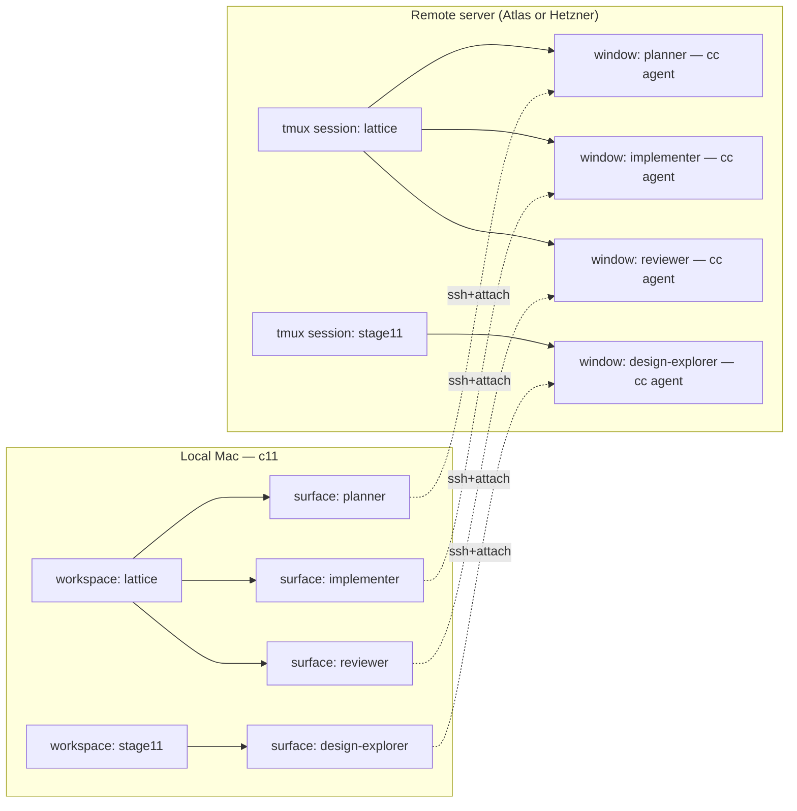
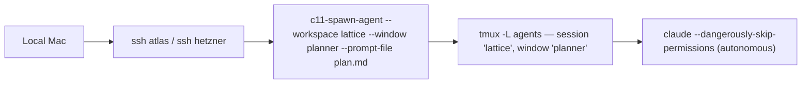
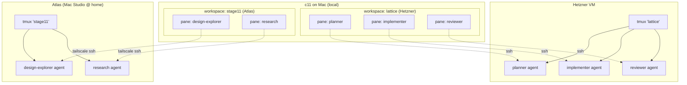

# Remote Autonomous Agents — Architecture

**Status:** working draft, base for shared understanding
**Author:** Ace + Atin (dialogue, 2026-05-12 → 2026-05-13)
**Scope:** how to run autonomous coding agents on a remote server (Atlas or Hetzner) and view/control them from a local Mac running c11
**Home in repo:** ships as part of c11 — `code/c11/`. Server-side shell scripts in `Resources/bin/`; local CLI subcommand in `CLI/Sources/Remote/`. Everyone with c11 gets the whole flow.

---

## Goals

What we are building toward, in priority order:

1. **Autonomous agents on the server.** The agents do work on a remote box; the local Mac is an *optional viewer*. Closing the laptop must not interrupt anything.
2. **Identical flow on Atlas and Hetzner.** Atlas is the always-on Mac Studio at home (already on the Tailscale net). Hetzner is a hosted Linux VM. The same `c11 remote spawn` invocation should land an agent on either, and the same `c11 remote attach` should view either. No per-host workflow drift.
3. **Easy to switch hosts.** Picking a target box should be a `--host` flag, not a different toolchain.
4. **c11 is the long-term local UI.** Raw `ssh + tmux attach` is acceptable as the bootstrap viewer to prove the loop end-to-end. We then swap that layer for c11 panes without changing the server side.
5. **Ships with c11.** This is part of c11's core offer — anyone running c11 should get remote-agent orchestration for free. Server-side artifacts are pure bash that c11 deploys to the host; only the operator's machine needs c11 itself.
6. **One thing at a time.** Each slice gets validated before the next is built. No multi-piece big-bangs.

---

## The mental model

Two layers, mapped 1:1:

| Remote (server) | Local (Mac, eventually c11) | What it holds |
|---|---|---|
| tmux **session** | c11 **workspace** | A logical project / context |
| tmux **window** | c11 **surface** | Exactly **one** autonomous agent |

This mapping is the architectural anchor. Get it right on the server side and the local viewer becomes a thin projection.



Key property: the agents live entirely in the remote tmux. The c11 panes on the left are **views**. Closing them does not stop the work; reopening them resumes the view.

---

## What we are building, slice by slice

Slices 1–3 are the manual end-to-end proof (bash scripts + raw SSH). Slices 4–6 wrap them in the `c11 remote` CLI and the c11 pane integration. Each slice gets validated before the next.

### Slice 1 — `c11-spawn-agent` shell script (server-side)

A bash script shipped in `code/c11/Resources/bin/c11-spawn-agent`. Manually scp'd to Atlas for slice 1; deployed by `c11 remote bootstrap` later. Run it on the box (over SSH) and it lands an autonomous Claude Code agent in the right tmux window, on a dedicated `-L agents` socket.

**Signature (proposed):**

```
c11-spawn-agent --workspace <name> --window <name> --prompt-file <path> [--cwd <path>]
c11-spawn-agent --workspace <name> --window <name> --prompt "<text>" [--cwd <path>]
```

**Behavior:**
- Uses `tmux -L agents` for everything (dedicated socket; no interference with operator's personal tmux).
- Idempotent on the session: if `agents` server isn't running, start it; if the named session doesn't exist, create it.
- The window is required to be new — error if it already exists, don't clobber a running agent.
- `--cwd` defaults to `$HOME` if omitted; passed as the new window's start directory.
- Inside the new window, run `claude --dangerously-skip-permissions` with the supplied prompt as the first message.
- Auth is whatever `claude login` already wrote to disk on this box. The script doesn't touch credentials.
- Print the tmux target (`-L agents <session>:<window>`) and exit.

**Why this first:** it's the smallest end-to-end slice that produces value. One command on the server → one autonomous agent surviving SSH disconnect, laptop close, and operator inattention. Everything else is built on top of this primitive.



### Slice 2 — `c11-bootstrap` + Hetzner provisioning

Two pieces:

1. **`c11-bootstrap` script** (also in `code/c11/Resources/bin/`): installs tmux, node, the `claude` CLI, drops `c11-spawn-agent` into `~/.local/bin/`, and prompts the operator to run `claude login` interactively. Identical script runs on macOS (Atlas) and Debian/Ubuntu (Hetzner) — uses `uname` to branch on package manager.

2. **Hetzner provisioning**: provision a fresh Hetzner Cloud VM (Ubuntu 24.04 LTS, CPX21 or similar), join it to Tailscale, set up SSH keys. Most likely driven by the `hcloud` CLI from a small one-shot bash script in `code/c11/scripts/` — Terraform is overkill for one box.

The proof for slice 2 is: provision a clean Hetzner box, run `c11-bootstrap` on it, run the **exact same** `c11-spawn-agent` invocation we ran on Atlas in slice 1, get the same result.

### Slice 3 — Manual viewer: raw SSH + tmux attach

No c11 wrapping yet. The viewer is a one-liner per agent:

```
ssh atlas -t "tmux -L agents attach -t lattice \; select-window -t planner"
```

Run it from any terminal (a c11 pane works fine, but we're not using any c11-specific machinery). Detach (`Ctrl-b d`) → agent keeps going. Close the laptop → agent keeps going. Come back, re-run → live transcript.

This proves the whole loop works without any new c11 code. After this we know the server side is solid before we layer the local CLI on top.

### Slice 4 — `c11 remote` CLI (local, the wrapping)

A new c11 subcommand namespace at `CLI/Sources/Remote/`:

```
c11 remote add <name> <ssh-target>      # register a host (e.g., c11 remote add atlas atin@atlas)
c11 remote ls                           # list registered hosts
c11 remote bootstrap <host>             # scp Resources/bin/c11-* over, run installer
c11 remote spawn --host <h> --workspace <ws> --window <w> --prompt-file <p> [--cwd <c>]
c11 remote agents <host>                # list running agent windows on a host
c11 remote rm <host>                    # forget a host
```

Host registry lives in c11's existing config dir. `spawn` is a thin wrapper: scp the prompt file (if local), then `ssh <host> 'c11-spawn-agent ...'`. No new logic on the server — slice 1 already did the work.

### Slice 5 — `c11 remote attach` (the c11 pane integration)

The slice that makes the diagram literal:

```
c11 remote attach --host atlas --workspace lattice --window planner
```

Wraps `c11 new-pane --type terminal --command "ssh atlas -t 'tmux -L agents attach ...'"`. Title and description on the new pane are auto-set from `<host>:<workspace>:<window>`. Detaching the pane (closing it, killing the SSH) leaves the agent untouched on the server.

After slice 5: open c11, run `c11 remote attach ...` → pane appears wired to the live agent. Mapping is literal.

### Slice 6 — Niceties

Whatever we want once the core loop feels good:
- `c11 remote attach-all <host>` opens one pane per running window in a workspace.
- `c11 remote logs <host> <ws> <window>` pulls the tmux scrollback without attaching.
- `c11 remote kill <host> <ws> <window>` stops an agent cleanly.
- A `c11 remote` blueprint that opens a workspace pre-populated with attaches to a named remote workspace.
- Eventually: a bidirectional translator so a c11 workspace **layout** (panes + splits) survives across hosts. (Probably out of scope until we feel pain.)

---

## Long-term: the c11 ↔ remote layout

Once all five slices land, the operator's day looks like this:



Properties this gives us:
- **Workspaces map across hosts.** A c11 workspace can hold panes that attach to different remote hosts. The local layout is independent of where the agents physically run.
- **Disconnection is free.** Closing any pane (or the whole laptop) just drops the SSH; the agent and its tmux window are untouched.
- **Reconnection is one command.** Re-run `c11-attach` on a fresh pane and you're back in the live transcript.
- **Host portability.** Moving an agent from Atlas to Hetzner (or vice-versa) means re-running `spawn-agent` on the other host with the same args. Same primitive, same prompt file.

---

## What we are explicitly NOT building yet

To keep the "one thing at a time" rule honest:

- ❌ Slices 4–6 until 1–3 feel solid.
- ❌ Cross-host agent migration / live-move.
- ❌ Shared state between agents (lattice tickets, mailbox, etc.) — handled by the existing Stage 11 stack, out of scope here.
- ❌ Any web UI / dashboard.
- ❌ Custom tmux config or theming. Boring defaults.
- ❌ Auto-spawn pools, queue systems, scheduling. Manual `c11 remote spawn` calls only, until we feel pain.
- ❌ Cross-host workspace layout sync. The c11 *workspace* is local; we only mirror remote tmux *windows* into it. Layout state stays on your Mac.

---

## Decisions locked

| Question | Decision |
|---|---|
| Where does the work live in the repo? | **`code/c11/`**. Server scripts in `Resources/bin/c11-*`; CLI subcommand in `CLI/Sources/Remote/`. Ships with c11. |
| Local CLI namespace? | **`c11 remote ...`** (mirrors `git remote`). |
| Tmux socket on the server? | **Dedicated `-L agents`** socket. Isolates from operator's personal tmux. |
| Auth on the server? | **`claude login` per box**, persisted on disk. We don't touch credentials. |
| One agent per tmux window? | **Yes.** Window ↔ surface, session ↔ workspace. |
| Order? | **Atlas first** (already up). Hetzner is the parity test in slice 2. |
| Hetzner state? | **Provision new in slice 2.** `hcloud` CLI; Ubuntu 24.04 LTS; Tailscale joined. |
| Where does `c11-spawn-agent` install on the box? | **`~/.local/bin/`**, dropped by `c11-bootstrap`. Per-user, no sudo. |
| `--cwd` default? | **`$HOME`** if not specified. |

## Still TBD (deferred — will resolve when we get there)

| Question | When we'll decide |
|---|---|
| What if the agent crashes / window dies? | After slice 3, when we've watched a few die and know what we want. |
| Restart-on-reboot? | After slice 6, if we still want it. tmux dies on reboot; tmux-resurrect-style layer is one option. |
| How do we bridge Lattice tickets / mailbox into remote agents? | Out of scope; handled upstream once the primitive is solid. |
| Multi-operator on one server? | Out of scope until we have a second operator. |

---

## Next concrete step

Build slice 1 on Atlas. Specifically:

1. Write `Resources/bin/c11-spawn-agent` as a small bash script in the c11 repo (`code/c11/`).
2. scp it to Atlas (manual; bootstrap comes in slice 2).
3. Run it with a trivial prompt: `c11-spawn-agent --workspace test --window haiku --prompt "Write a haiku about the spike. Save it to /tmp/haiku.txt and exit."`
4. Verify: `tmux -L agents ls` shows the session; the window survives SSH detach; `/tmp/haiku.txt` appears; the window stays alive at idle after the agent finishes.
5. Confirm Atlas already has `claude` authenticated (run `claude --version` and a no-op invocation manually first).

Once that loop closes cleanly, we move to slice 2 (bootstrap + Hetzner).
