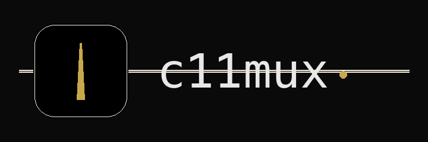

<h1 align="center">c11mux</h1>
<p align="center">
  <i>the Stage 11 terminal multiplexer for AI coding agents</i>
</p>
<p align="center">
  
</p>

<p align="center">
  <a href="https://github.com/Stage-11-Agentics/c11mux/releases/latest/download/c11mux-macos.dmg">
    
  </a>
</p>

<p align="center">
  English | <a href="README.ja.md">日本語</a> | <a href="README.vi.md">Tiếng Việt</a> | <a href="README.zh-CN.md">简体中文</a> | <a href="README.zh-TW.md">繁體中文</a> | <a href="README.ko.md">한국어</a> | <a href="README.de.md">Deutsch</a> | <a href="README.es.md">Español</a> | <a href="README.fr.md">Français</a> | <a href="README.it.md">Italiano</a> | <a href="README.da.md">Dansk</a> | <a href="README.pl.md">Polski</a> | <a href="README.ru.md">Русский</a> | <a href="README.bs.md">Bosanski</a> | <a href="README.ar.md">العربية</a> | <a href="README.no.md">Norsk</a> | <a href="README.pt-BR.md">Português (Brasil)</a> | <a href="README.th.md">ไทย</a> | <a href="README.tr.md">Türkçe</a> | <a href="README.km.md">ភាសាខ្មែរ</a>
</p>

<p align="center">
  
</p>

<p align="center">
  <a href="https://www.youtube.com/watch?v=i-WxO5YUTOs">▶ Demo video</a> · <a href="https://cmux.com/blog/zen-of-cmux">The Zen of cmux</a>
</p>

## Fork notice

**c11mux is a Stage 11 Agentics fork of [cmux](https://github.com/manaflow-ai/cmux) by [manaflow-ai](https://github.com/manaflow-ai).** All credit for the underlying terminal, browser, notification, and CLI work belongs to the upstream authors. This fork exists so Stage 11 can ship its own distribution, experiment with agent-orchestration features that don't fit upstream's direction, and iterate on changes that may or may not land back in cmux.

What changes in the fork: app display name (**c11mux**), bundle ID (`com.stage11.c11mux`), release artifacts, Homebrew tap, and the Sparkle auto-update feed. What stays identical to upstream: the `cmux` CLI binary name, every `CMUX_*` environment variable, socket paths and protocol, shell integration scripts, and all CLI subcommands — so existing scripts, dotfiles, and third-party tools keep working unchanged.

- Upstream: <https://github.com/manaflow-ai/cmux>
- License: [AGPL-3.0-or-later](./LICENSE) (inherited from upstream; see [NOTICE](./NOTICE) for attribution and a summary of modifications).

## Features

<table>
<tr>
<td width="40%" valign="middle">
<h3>Notification rings</h3>
Panes get a blue ring and tabs light up when coding agents need your attention
</td>
<td width="60%">

</td>
</tr>
<tr>
<td width="40%" valign="middle">
<h3>Notification panel</h3>
See all pending notifications in one place, jump to the most recent unread
</td>
<td width="60%">

</td>
</tr>
<tr>
<td width="40%" valign="middle">
<h3>In-app browser</h3>
Split a browser alongside your terminal with a scriptable API ported from <a href="https://github.com/vercel-labs/agent-browser">agent-browser</a>
</td>
<td width="60%">

</td>
</tr>
<tr>
<td width="40%" valign="middle">
<h3>Vertical + horizontal tabs</h3>
Sidebar shows git branch, linked PR status/number, working directory, listening ports, and latest notification text. Split horizontally and vertically.
</td>
<td width="60%">

</td>
</tr>
</table>

- **Scriptable** — CLI and socket API to create workspaces, split panes, send keystrokes, and automate the browser
- **Native macOS app** — Built with Swift and AppKit, not Electron. Fast startup, low memory.
- **Ghostty compatible** — Reads your existing `~/.config/ghostty/config` for themes, fonts, and colors
- **GPU-accelerated** — Powered by libghostty for smooth rendering

## Install

### DMG (recommended)

<a href="https://github.com/Stage-11-Agentics/c11mux/releases/latest/download/c11mux-macos.dmg">
  
</a>

Open the `.dmg` and drag c11mux to your Applications folder. c11mux auto-updates via Sparkle, so you only need to download once.

### Homebrew

```bash
brew tap stage-11-agentics/c11mux
brew install --cask c11mux
```

To update later:

```bash
brew upgrade --cask c11mux
```

The c11mux cask conflicts with the upstream `cmux` cask — installing one will ask you to remove the other. On first launch, macOS may ask you to confirm opening an app from an identified developer. Click **Open** to proceed.

## Why cmux?

_The following section is from the upstream cmux README and describes the original motivation for the project. c11mux inherits all of it._

I run a lot of Claude Code and Codex sessions in parallel. I was using Ghostty with a bunch of split panes, and relying on native macOS notifications to know when an agent needed me. But Claude Code's notification body is always just "Claude is waiting for your input" with no context, and with enough tabs open I couldn't even read the titles anymore.

I tried a few coding orchestrators but most of them were Electron/Tauri apps and the performance bugged me. I also just prefer the terminal since GUI orchestrators lock you into their workflow. So I built cmux as a native macOS app in Swift/AppKit. It uses libghostty for terminal rendering and reads your existing Ghostty config for themes, fonts, and colors.

The main additions are the sidebar and notification system. The sidebar has vertical tabs that show git branch, linked PR status/number, working directory, listening ports, and the latest notification text for each workspace. The notification system picks up terminal sequences (OSC 9/99/777) and has a CLI (`cmux notify`) you can wire into agent hooks for Claude Code, OpenCode, etc. When an agent is waiting, its pane gets a blue ring and the tab lights up in the sidebar, so I can tell which one needs me across splits and tabs. Cmd+Shift+U jumps to the most recent unread.

The in-app browser has a scriptable API ported from [agent-browser](https://github.com/vercel-labs/agent-browser). Agents can snapshot the accessibility tree, get element refs, click, fill forms, and evaluate JS. You can split a browser pane next to your terminal and have Claude Code interact with your dev server directly.

Everything is scriptable through the CLI and socket API — create workspaces/tabs, split panes, send keystrokes, open URLs in the browser.

## The Zen of cmux

cmux is not prescriptive about how developers hold their tools. It's a terminal and browser with a CLI, and the rest is up to you.

cmux is a primitive, not a solution. It gives you a terminal, a browser, notifications, workspaces, splits, tabs, and a CLI to control all of it. cmux doesn't force you into an opinionated way to use coding agents. What you build with the primitives is yours.

The best developers have always built their own tools. Nobody has figured out the best way to work with agents yet, and the teams building closed products definitely haven't either. The developers closest to their own codebases will figure it out first.

Give a million developers composable primitives and they'll collectively find the most efficient workflows faster than any product team could design top-down.

## Documentation

For more info on how to configure cmux, [head over to our docs](https://cmux.com/docs/getting-started?utm_source=readme).

## Keyboard Shortcuts

### Workspaces

| Shortcut | Action |
|----------|--------|
| ⌘ N | New workspace |
| ⌘ 1–8 | Jump to workspace 1–8 |
| ⌘ 9 | Jump to last workspace |
| ⌃ ⌘ ] | Next workspace |
| ⌃ ⌘ [ | Previous workspace |
| ⌘ ⇧ W | Close workspace |
| ⌘ ⇧ R | Rename workspace |
| ⌘ B | Toggle sidebar |

### Surfaces

| Shortcut | Action |
|----------|--------|
| ⌘ T | New surface |
| ⌘ ⇧ ] | Next surface |
| ⌘ ⇧ [ | Previous surface |
| ⌃ Tab | Next surface |
| ⌃ ⇧ Tab | Previous surface |
| ⌃ 1–8 | Jump to surface 1–8 |
| ⌃ 9 | Jump to last surface |
| ⌘ W | Close surface |

### Split Panes

| Shortcut | Action |
|----------|--------|
| ⌘ D | Split right |
| ⌘ ⇧ D | Split down |
| ⌥ ⌘ ← → ↑ ↓ | Focus pane directionally |
| ⌘ ⇧ H | Flash focused panel |

### Browser

Browser developer-tool shortcuts follow Safari defaults and are customizable in `Settings → Keyboard Shortcuts`.

| Shortcut | Action |
|----------|--------|
| ⌘ ⇧ L | Open browser in split |
| ⌘ L | Focus address bar |
| ⌘ [ | Back |
| ⌘ ] | Forward |
| ⌘ R | Reload page |
| ⌥ ⌘ I | Toggle Developer Tools (Safari default) |
| ⌥ ⌘ C | Show JavaScript Console (Safari default) |

### Notifications

| Shortcut | Action |
|----------|--------|
| ⌘ I | Show notifications panel |
| ⌘ ⇧ U | Jump to latest unread |

### Find

| Shortcut | Action |
|----------|--------|
| ⌘ F | Find |
| ⌘ G / ⌘ ⇧ G | Find next / previous |
| ⌘ ⇧ F | Hide find bar |
| ⌘ E | Use selection for find |

### Terminal

| Shortcut | Action |
|----------|--------|
| ⌘ K | Clear scrollback |
| ⌘ C | Copy (with selection) |
| ⌘ V | Paste |
| ⌘ + / ⌘ - | Increase / decrease font size |
| ⌘ 0 | Reset font size |

### Window

| Shortcut | Action |
|----------|--------|
| ⌘ ⇧ N | New window |
| ⌘ , | Settings |
| ⌘ ⇧ , | Reload configuration |
| ⌘ Q | Quit |

## Nightly Builds

[Download c11mux NIGHTLY](https://github.com/Stage-11-Agentics/c11mux/releases/download/nightly/c11mux-nightly-macos.dmg)

c11mux NIGHTLY is a separate app with its own bundle ID, so it runs alongside the stable version. Built automatically from the latest `main` commit and auto-updates via its own Sparkle feed.

Report nightly bugs on [Stage 11's GitHub Issues](https://github.com/Stage-11-Agentics/c11mux/issues). Nightly feedback that applies to behavior inherited from upstream is also welcome on [manaflow-ai/cmux issues](https://github.com/manaflow-ai/cmux/issues).

## Session restore (current behavior)

On relaunch, c11mux currently restores app layout and metadata only:
- Window/workspace/pane layout
- Working directories
- Terminal scrollback (best effort)
- Browser URL and navigation history

c11mux does **not** restore live process state inside terminal apps. For example, active Claude Code/tmux/vim sessions are not resumed after restart yet.

## Star History (upstream)

The chart below tracks stars on the upstream [manaflow-ai/cmux](https://github.com/manaflow-ai/cmux) repository, which c11mux is derived from.

<a href="https://star-history.com/#manaflow-ai/cmux&Date">
 <picture>
   <source media="(prefers-color-scheme: dark)" srcset="https://api.star-history.com/svg?repos=manaflow-ai/cmux&type=Date&theme=dark" />
   <source media="(prefers-color-scheme: light)" srcset="https://api.star-history.com/svg?repos=manaflow-ai/cmux&type=Date" />
   
 </picture>
</a>

## Contributing

c11mux contributions that are specific to the Stage 11 fork (branding, Stage 11-only features, fork-specific infrastructure) can be opened against [Stage-11-Agentics/c11mux](https://github.com/Stage-11-Agentics/c11mux). For anything that would benefit all cmux users — bug fixes, general features, upstream-applicable improvements — please consider contributing to the upstream project so the whole community benefits:

- [manaflow-ai/cmux issues](https://github.com/manaflow-ai/cmux/issues) and [discussions](https://github.com/manaflow-ai/cmux/discussions)
- [manaflow-ai Discord](https://discord.gg/xsgFEVrWCZ)
- Follow upstream on X: [@manaflowai](https://x.com/manaflowai), [@lawrencecchen](https://x.com/lawrencecchen), [@austinywang](https://x.com/austinywang)

## Upstream community

c11mux inherits its lineage and spirit from upstream. These are the upstream cmux community channels:

- [Discord](https://discord.gg/xsgFEVrWCZ)
- [GitHub](https://github.com/manaflow-ai/cmux)
- [X / Twitter](https://twitter.com/manaflowai)
- [YouTube](https://www.youtube.com/channel/UCAa89_j-TWkrXfk9A3CbASw)
- [LinkedIn](https://www.linkedin.com/company/manaflow-ai/)
- [Reddit](https://www.reddit.com/r/cmux/)

## Founder's Edition (upstream)

The Founder's Edition below is offered by the upstream cmux project. It is not affiliated with Stage 11 Agentics, and supporting it supports the upstream authors — which we encourage.

cmux is free, open source, and always will be. If you'd like to support upstream development and get early access to what's coming next:

**[Get Founder's Edition](https://buy.stripe.com/3cI00j2Ld0it5OU33r5EY0q)**

- **Prioritized feature requests/bug fixes**
- **Early access: cmux AI that gives you context on every workspace, tab and panel**
- **Early access: iOS app with terminals synced between desktop and phone**
- **Early access: Cloud VMs**
- **Early access: Voice mode**
- **Personal iMessage/WhatsApp access**

## License

c11mux is licensed under the GNU Affero General Public License v3.0 or later (`AGPL-3.0-or-later`), the same license as upstream cmux.

See [`LICENSE`](./LICENSE) for the full text and [`NOTICE`](./NOTICE) for attribution and a summary of modifications made in this fork.
