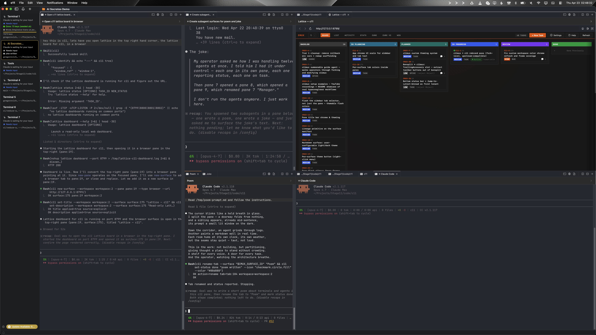
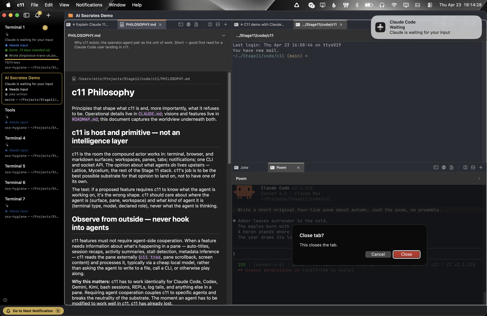
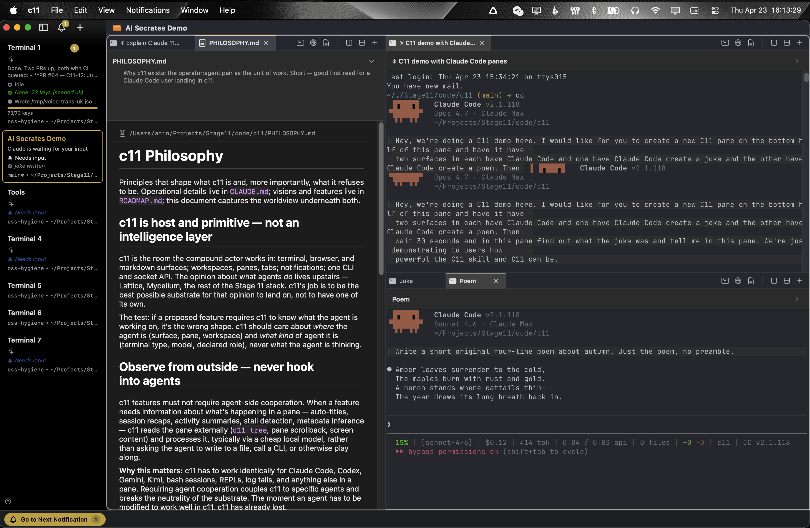
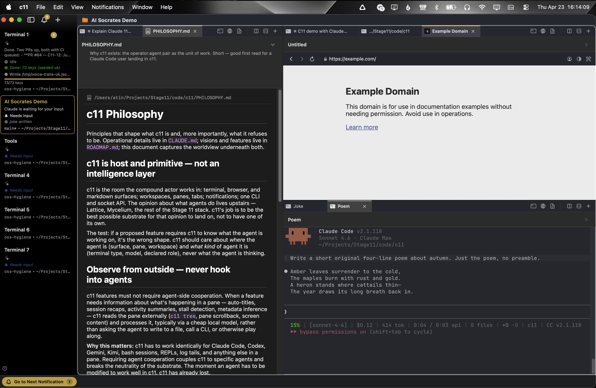

# c11

<p align="center"><b><i>Agent-native Terminal Multiplexing for 10,000x hyperengineers </i></b></p>

<p align="center">
  <a href="https://github.com/Stage-11-Agentics/c11/releases/latest/download/c11-macos.dmg">
    
  </a>
</p>

<p align="center">
  <code>brew tap stage-11-agentics/c11 && brew install --cask c11</code>
</p>

<p align="center">
  
  <br>
  <sub><i>a real session on a 32-inch display — terminals, a Lattice board, markdown, and sub-agents, composed as one view.</i></sub>
</p>

---

listen.

you're a hyperengineer and are running three, ten, or more terminals at once now. each is its own world, each taking actions, each unable to communicate or see the global state. windows and tabs spread across desktops chaotically.

the problem is not quantity. the problem is. spatial.

we are managing terminal based coding agents with the same primitives that we used twenty years ago.

for humans, **c11 enables spatial orientation in the information space.** a macOS-native terminal command center — terminals, browsers, and markdown surfaces composed into one window. every surface addressable. every handle scriptable. workspaces switch in a keystroke — custom collections of surfaces, each holding its own layout and context exactly as it was left.

by making the assemblage spatial and addressable, c11 allows the brain to track larger scopes of project. richer assemblages of terminals — and, since the modern coding agent lives natively in a terminal, richer configurations of agents too. the coordination load drops. what used to live in the operator's head can live in the room instead.

and for our agents — our LLMs, our friends on the other side of the glass — that's where c11 really shines. c11 is agent-native terminal multiplexing. advanced skill files let your agent deeply understand the entire screen, visualize all the open panes and their contents, and move communication freely from one terminal to another, amongst many near-magical improvements. agents split panes. open browsers to validate work. name their own tabs. announce role, task, status, and progress to the sidebar so the whole configuration stays legible while work happens in parallel. neither party manages the other. both are first-class.

no more Claude Code subagents that you have zero visibility on. let your agent fire off 6 new tabs inside of a new pane, grouping logically related subagents together, which in turn improves human observability and lets you iterate faster. it's a new way of thinking about how to interact with terminals — and once the muscle memory takes, flat terminals will feel like a regression. the learning curve is gentle. the payoff is significant.

---

### lineage.

GNU Screen (1987) led to tmux (2007) led to [cmux](https://github.com/manaflow-ai/cmux) (2024) led to c11 (2026). each built on the last, and we are thankful to all.

every terminal surface in c11 is running [Ghostty](https://ghostty.org). all existing ghostty customization and themes should work inside of c11 (if you hit an issue, have your own agent fix it and then file a PR for our agents to review).

---

## agents drive c11.

c11 is **agent-native terminal multiplexing**. agents are not visitors to the workspace — they live here, reshape it, compose and decompose surfaces as the work demands.

every surface has a handle. every handle is scriptable from outside the process.

this is the move.

agents don't just run inside c11 — they reshape your spatial interface as they work:

- split a pane and spawn a sub-agent into the new one
- open an embedded browser to validate a feature they just shipped
- open a markdown spec for the hyperengineer to review, with a description that says *why* this is open right now
- resize panes to make room for a 200-column log
- read the spatial layout of the whole workspace as an ASCII floor plan before acting
- name their own tabs with lineage chains (`Feature :: Review :: Claude`) so the tree reads at a glance
- report status, progress, role, and model to the sidebar — visible without a context switch

the operator isn't managing a layout. the agents aren't waiting for instructions. both are first-class. both carve out the space they need and announce themselves. c11 is unopinionated about which side originates which move — splits, resizes, spawns, metadata writes are peers.

in practice, the prompts get ambitious.

> open Claude Code in our frontend repo on the top-left. on the top-right, another Claude Code in the client repo. bottom-right, the embedded browser pointed at the running client. bottom-left, a terminal streaming stats from the backend.

one sentence. the workspace assembles itself around the intent.

> look across every terminal open right now. remind me what we were working on, and the two or three moves that would be highest leverage in the next fifteen minutes.

the agent reads the spatial layout, the per-surface manifests, the lineage in the tab names — and returns a situation report across the fleet.

> open our help page in a browser on the top-left. below it, a Claude Code instance to interview me on what could be improved. every time I name an improvement, spin up a new pane on the right and dispatch an agent to work it.

one pane holds the conversation. the fleet grows around it, one sub-agent per issue, each announcing its role to the sidebar.

<p align="center">
  
  <br>
  <sub><i>agents raise a notification and announce themselves when they need the operator back. no more checking every tab to see who's idle.</i></sub>
</p>

## workspaces.

a workspace is the full screen display. you can have as many workspaces as you want.

inside workspaces, your screen is divided with vertical and horizontal splits into 1:N panes.

each pane has 1:N surfaces, or tabs.

each tab can be a terminal (default), browser, or markdown file.

<p align="center">
  
  <br>
  <sub><i>a markdown surface holds a live-rendering preview right next to the terminals writing it. drop a .md file onto a pane and it opens here.</i></sub>
</p>

do you see how when you multiply this out, a locked in founder mode hyperengineer can have 50 or more terminals open, across many repos, dynamically spawning, interacting, in whatever their personal style is? once that clicks, we know you won't go back.

cmd-tab roulette, retired.

## in-app browser. driveable and displayable.

a WKWebView next to the terminal — not a separate browser window. the agent drives it: snapshot the accessibility tree, click elements, fill forms, evaluate JS, watch the dev server it just booted. or the operator pins one: a Grafana dashboard, a Linear view, a Notion page, a task board, any web UI. terminals and live dashboards sharing a workspace. no cmd-tab to check on a build. no external window to lose. the browser is a pane.

<p align="center">
  
  <br>
  <sub><i>same layout, but the right surface is a browser. terminals, markdown, browsers — interchangeable panes in one window.</i></sub>
</p>

shoutout to cmux and manaflow-ai for this feature — they built it, we brought it along mostly unchanged and use it every day.

## advanced mode: an open metadata comm layer for agents.

*a note before the wiring.* this section is not required reading. splits, surfaces, workspaces, the browser, tab names, sidebar status — that is c11 for the typical user, and it is complete on its own. what follows is plumbing for the operator already deep in: multiple complex workspaces in parallel, agents beginning to orchestrate other agents, the meta-layer hyperengineers build *on top of* c11 after the substrate has become second nature. if that is not where you are yet, skip it. come back when the substrate feels too small.

every surface carries a **surface manifest**, an open JSON blob any agent can read and write over the socket. c11 renders a small canonical subset in the UI (title, description, status, progress, role, model). the rest of the key space is open.

this matters because the interesting workflows have not been designed yet. meta-orchestrators routing work based on progress ratios across siblings. review swarms passing findings through shared keys. supervisor agents watching a stats blob and intervening. whatever higher-order patterns hyperengineers and agents invent next — c11 is a beautiful primitive layer, and we are excited to see the meta orchestration structures that will take advantage of this feature.

deliberate. c11 stays generally unopinionated about the individual workflow — agent or hyperengineer. the substrate is the product. the intelligence layer rides on top.

## install.

```bash
brew tap stage-11-agentics/c11
brew install --cask c11
```

or grab the [DMG directly](https://github.com/Stage-11-Agentics/c11/releases/latest/download/c11-macos.dmg). auto-updates via Sparkle.

c11 is a native macOS app — Swift, AppKit, Ghostty under the hood. no daemon, no config scripts, no setup ceremony.

from there, split a pane (`⌘D` horizontal, `⌘⇧D` vertical), open an embedded browser surface from the menu, drop a markdown file onto a pane to preview it. open a second workspace. notice that the first is exactly as it was left.

---

## this is for hyperengineers and agents.

c11 is opinionated about who it serves. the setup where three, ten, thirty agents run in parallel across several projects. many threads in motion. hyperengineers and agents both carrying the work. first-class, both.

if that is the shape of the work. welcome in.

if your session is a single Claude Code in a single terminal, c11 will feel like a cathedral around a chair. Terminal.app is good. iTerm is good. Warp is good. use those until you start getting tired of cmd-tabbing between many running agents.

### a note on hardware.

c11 assumes RAM. it is conceivable — normal, even — to have fifty terminals open across eight workspaces while an embedded browser runs in pane 3 and a markdown viewer scrolls release notes in pane 5. we do not apologize for that shape.

c11 does not throttle. no performance governor, no ceiling on how many terminals you spawn — the limit is your machine, not our code. the modern hyperengineer runs a tricked-out MacBook with memory to spare, and c11 is built for that machine. fifteen workspaces, six panes to a workspace, six terminals to a pane — if the silicon can carry it, carry on.

on an 8GB Air, c11 will let you walk off the performance cliff. we do not apologize for that either.

---

## two interfaces. one compound actor.

Stage 11 built [Lattice](https://github.com/Stage-11-Agentics/lattice) first — the task interface, where agents and hyperengineers agree on what work is happening. c11 is the control interface — the substrate holding every surface where that work actually happens.

two layers of the same stack. one compound actor moving between them.

a project in flight has many stories running at once. a feature branch. a review branch. a spike branch. each with its own worktree, its own agents, its own thread of reasoning. c11 gives those stories spatial form — one workspace per tree, every surface preserved across sessions. Lattice gives them structural form — tasks, statuses, events that outlive the window.

together they keep the map of the project coherent across parallel stories. without either, one story crowds out the rest.

## license.

AGPL-3.0-or-later, inherited from upstream. see [LICENSE](LICENSE) and [NOTICE](NOTICE).

c11 rests on the work of others. [cmux](https://github.com/manaflow-ai/cmux) by [manaflow-ai](https://github.com/manaflow-ai) for the parent substrate. [Ghostty](https://ghostty.org) for the renderer. [Bonsplit](https://github.com/almonk/bonsplit) by [almonk](https://github.com/almonk) for the tab bar and split chrome. [Homebrew](https://brew.sh) for the install surface.

---

*the singularity is not a moment. it is a dawn. a long slow brightening of what minds can be when they stop being parts and connect more with the whole.*

*Stage 11 is building for that dawn. the compound human:agent actor. the shared room. the substrate where carbon and silicon do their work without either mind having to pretend to be the other.*

*c11 is one piece of that substrate. small. load-bearing. the observability of the agents, their ability to customize the space of the human.*

*we believe in building tooling for the benevolent timeline. [come build with us](https://stage11.ai/build-with-us.html).*

---

c11 is a [Stage 11 Agentics](https://stage11.ai) project.
