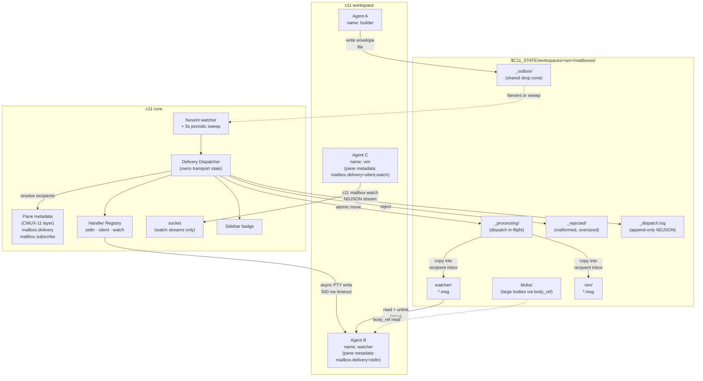
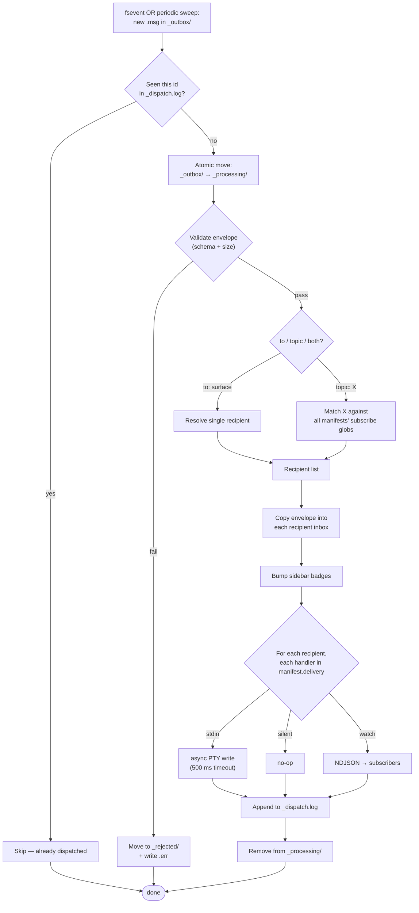
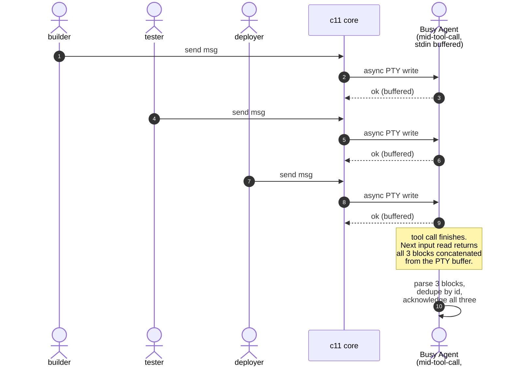
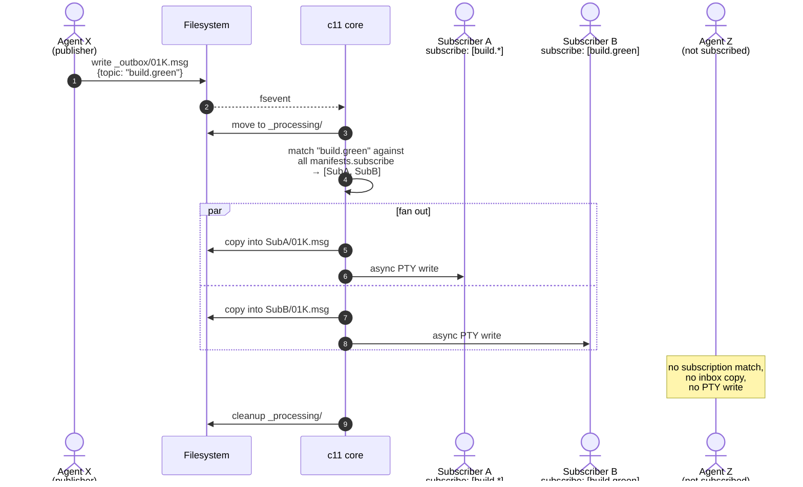
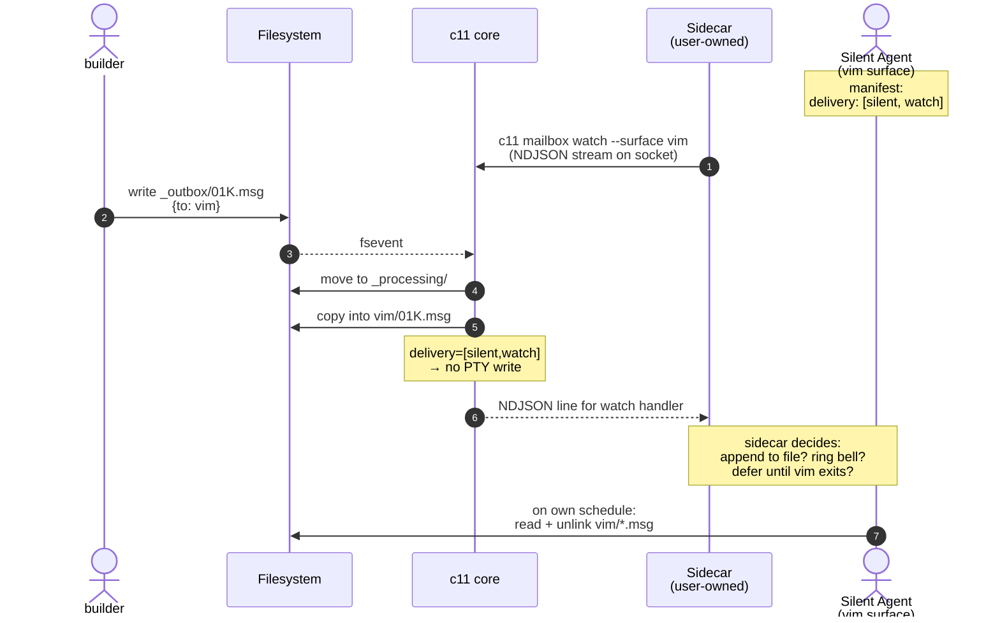
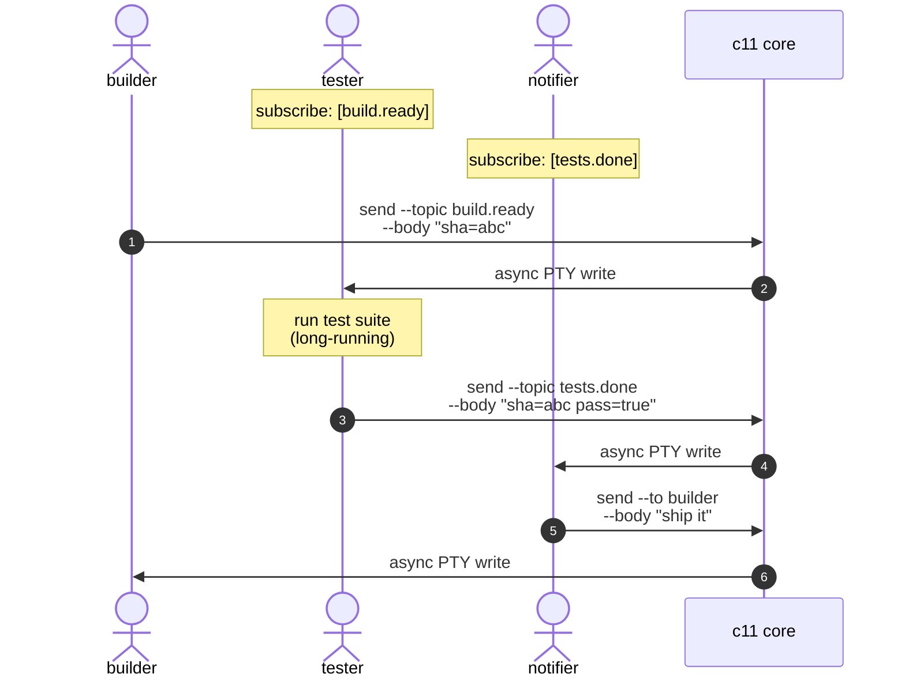

# c11 Inter-Agent Messaging — Design

**Status:** v1 scope locked after merged Claude + Codex review (2026-04-23). Ready for vertical-slice prototype.
**Goal:** the smallest primitive that lets agents running in separate c11 surfaces coordinate, without c11 imposing a protocol.
**Ticket:** [C11-13](../.lattice/notes/task_01KPYFX4PV4QQQYHCPE0R02GEZ.md)

## v1 scope at a glance

**Ship in v1:**
- Filesystem contract per workspace: `$C11_STATE/workspaces/<workspace-id>/mailboxes/` with shared `_outbox/`, per-surface inboxes
- Surface addressing via **surface names** (from CMUX-11 nameable-panes metadata); no separate mailbox-alias layer
- Messaging config stored as **namespaced keys in the existing pane metadata** (`mailbox.delivery`, `mailbox.subscribe`, `mailbox.retention_days`); no parallel `manifest.json` file
- Handlers: `stdin`, `silent`, `watch`
- Topic subscribe globs in pane metadata + dispatch-time fan-out
- Envelope schema locked as public API (JSON Schema + golden fixtures)
- CLI + file-write parity test as drift enforcement
- `--via-ref` / `body_ref` safety valve for oversized bodies (hard cap on inline body ~4 KB; allowlisted to per-workspace `blobs/` dir)
- At-least-once delivery; receivers dedupe by `id`
- Observability: append-only `_dispatch.log` NDJSON
- Reliability: periodic `_outbox/` sweep, atomic `_processing/` dispatch marker, stale `.tmp` GC, async PTY writes with timeout
- Per-surface inbox cap of 1000 pending envelopes; over-limit → `_rejected/` with reason `recipient_inbox_full`

**Deferred to v1.1+:**
- `exec`, `webhook`, `file-tail`, `signal` handlers (require security model first)
- Topic discovery registry (`_topics.json`, `advertises`, `mailbox topics describe`)
- TOON output format
- Manifest-level auth allow/deny lists
- Full dispatch state machine beyond the log

**Out of scope:**
- Remote workspace mailbox sync
- Cross-user messaging
- Ack/receipt protocol (agents build on top)

---

## Principles at a glance

- **The filesystem is the contract for content.** Message envelopes live on disk as plain JSON files under `$C11_STATE/workspaces/<workspace-id>/mailboxes/`. Any process that can write a file can send or receive — no SDK required.
- **Config lives in pane metadata, not a parallel file.** Delivery modes and subscriptions are stored as namespaced keys (`mailbox.delivery`, `mailbox.subscribe`, …) in the existing CMUX-11 pane metadata layer. Single source of truth; composes cleanly with CMUX-37 Blueprints/Snapshots.
- **Surface names are mailbox aliases.** The name you set with `c11 set-title` / nameable-panes IS the messaging address. No second identity layer.
- **Two interfaces for content, one interface for config.** Send/recv: direct file I/O **or** `c11 mailbox …` CLI, equivalent and parity-tested. Configure: `c11 mailbox configure` (wraps the same metadata commands the rest of c11 uses).
- **Socket is for live streams, not storage.** `c11 mailbox watch` uses the socket (long-lived connection). Send / recv go through files.
- **Delivery is framed text into the PTY** for stdin-delivery agents; for others, delivery runs through handlers declared in pane metadata. PTY writes are **asynchronous with a 500 ms timeout** — they are not the queue, the inbox is.
- **At-least-once delivery.** Envelopes survive dispatcher crashes; periodic sweep re-delivers on restart. **Receivers dedupe by `id`.** This is the contract.
- **Receiver-declared, sender-hints.** Recipients declare how they want messages delivered via their own pane metadata. Senders can add attributes (`urgent: true`, …) that handlers may or may not honor.
- **Per-workspace scoping.** Mailbox trees are sealed per workspace. Cross-workspace messaging is out of scope for v1.
- **Grammar is the skill.** The `c11` skill teaches the XML-tag format, default protocol, file layout, and CLI shortcuts.

c11 stays out of the body. Schemas, RPC, workflows, acks — all that lives in developer-land on top of this primitive.

---

## Proposed wire format (the PTY-framed block)

XML-style tag with attributes. LLM-native (Claude, Codex, Kimi parse `<tag attr="value">…</tag>` instantly). One line of metadata, plain-text body, one closing tag.

```

<c11-msg from="builder" topic="ci-status" id="01K3A2B7X" ts="2026-04-23T10:15:42Z">
build green sha=abc
</c11-msg>

```

- One leading blank line separates the block from prior output.
- Metadata lives in attributes on the opening tag. Extensible: `urgent="true"`, `reply_to="watcher"`, `in_reply_to="01K3ABC"`, `body_ref="/path/to/body"`.
- Body is opaque plain text between the tags.
- One trailing blank line lets multiple blocks stack cleanly.

**Escaping and injection defense.** If the body contains `<`, `>`, or `&`, c11 applies standard XML escaping on write (`&lt;`, `&gt;`, `&amp;`). This is a deliberate **security property**: a literal `</c11-msg>` inside a message body cannot forge a closing tag. Attribute values receive the same escaping. Skill tells the agent to unescape on read. Well-understood convention; no new invention.

---

## 1. Architecture at a glance

The core loop: senders write envelopes to a per-workspace shared outbox directory; c11 watches it via fsevents; on each new envelope, c11 atomically moves it into `_processing/`, resolves recipients by looking at pane metadata (delivery modes + subscribe globs), copies the envelope into recipient inboxes, runs the configured delivery handlers, and removes the envelope from `_processing/` only when all handlers have succeeded or durably failed. A periodic sweep re-scans `_outbox/` for missed events.



**What each piece does**

| Piece | Role |
|---|---|
| `_outbox/` | Shared drop zone. Any process writes envelope files here. `$C11_STATE` is mode 700. |
| `_processing/` | Atomic move target when the dispatcher starts handling an envelope. Prevents duplicate dispatch under fsevent replay. |
| `_rejected/` | Malformed, oversized, or otherwise invalid envelopes land here with a sibling `.err` file explaining why. |
| `blobs/` | Allowlisted location for `body_ref` payloads. Senders use this for bodies >4 KB. Recipients read directly. |
| Per-surface inboxes | `$C11_STATE/workspaces/<ws>/mailboxes/<surface-name>/` contains pending `.msg` envelopes. Recv = list, read, unlink. Directory named after the surface (from CMUX-11 nameable-panes metadata). |
| `_dispatch.log` | Append-only NDJSON dispatch record, one line per dispatch event. Cheapest high-leverage observability. |
| **Pane metadata (CMUX-11)** | Source of truth for per-surface config: `mailbox.delivery`, `mailbox.subscribe`, `mailbox.retention_days`. Dispatcher reads via c11's existing metadata APIs, not via filesystem. |
| fsevent watcher + sweep | Watches `_outbox/` for new `.msg` files, plus a periodic 5-second sweep as belt-and-suspenders. |
| Delivery Dispatcher | **Owns transport state** (not stateless): fsevent dedupe, quarantine, stale-tmp GC, handler invocation, dispatch log writes. Does **not** own business protocol state (acks, workflows). |
| Handler Registry | v1: `stdin`, `silent`, `watch`. Registry shape designed so `exec`, `webhook`, `file-tail` can land later without dispatcher changes. |
| Socket | Used only for long-lived operations: `c11 mailbox watch`. Send / recv do **not** touch the socket. Configure goes through socket metadata commands (same path as `c11 set-metadata`). |
| Sidebar badge | Visual salience for the operator. Fires regardless of delivery mode. |
| CLI | `c11 mailbox send / recv / watch / configure` — thin wrappers over file operations and existing metadata commands. |

---

## 2. Delivery mechanisms — pluggable by design

**Receiver-declared, not sender-imposed.** Each surface's own pane metadata says how it wants messages delivered. Senders hand c11 an envelope; they do not pick the delivery mode.

### Config keys (in pane metadata)

Messaging config lives in the existing CMUX-11 pane metadata layer as namespaced keys:

| Key | Value | Meaning |
|---|---|---|
| `mailbox.delivery` | comma-separated list | e.g. `"stdin,watch"`, `"silent"`. Selects handlers. |
| `mailbox.subscribe` | comma-separated globs | e.g. `"build.*,deploy.green"`. Topic subscription patterns. |
| `mailbox.retention_days` | integer string | e.g. `"7"`. Inbox envelope retention. Defaults to 7. |
| `mailbox.advertises` | v1.1 — deferred | Topic discovery metadata. |

c11 reads these via the same path it already uses for pane metadata (socket `get-metadata`), not by parsing a file in the mailbox directory. **Pane metadata is the single source of truth.** This composes cleanly with CMUX-37's Blueprints and Snapshots: mailbox config rides along in `SurfaceSpec.metadata` when the workspace is serialized or restored.

### Configure — three equivalent ways

**CLI (ergonomic):**
```
c11 mailbox configure --delivery stdin,watch
c11 mailbox configure --subscribe "build.*,deploy.green"
c11 mailbox configure --retention-days 14
```

**Generic metadata command (existing):**
```
c11 set-metadata --key mailbox.delivery --value stdin,watch
c11 set-metadata --key mailbox.subscribe --value "build.*,deploy.green"
```

**Blueprint frontmatter (when CMUX-37 lands):**
```yaml
surfaces:
  - name: watcher
    metadata:
      mailbox.delivery: stdin,watch
      mailbox.subscribe: "build.*,deploy.green"
```

All three write to the same pane metadata. No drift — the CLI wrapper calls the same API the generic metadata command calls.

### Inspecting

```
c11 mailbox show-config [--surface <name>]    # prints mailbox.* keys for this or a named surface
c11 get-metadata --key mailbox.delivery        # one-key read
```

### Handlers in v1

| Handler | What it does | Who it's for |
|---|---|---|
| `stdin` | Writes the `<c11-msg>` framed block to the recipient's PTY **asynchronously** with a 500 ms timeout. Logs failure on EIO/EPIPE/timeout, leaves envelope in inbox for self-retrieval. | Default for agent surfaces (Claude Code, Codex, Kimi, plain REPLs). Not auto-selected for unknown surface types — must be declared in manifest. |
| `silent` | No-op beyond the mailbox write. Recipient fetches via `recv` or `watch`. | Full-screen raw-mode TUIs (vim, lazygit). Agents that want zero side effects. |
| `watch` | Pushes an NDJSON line to active `c11 mailbox watch` subscribers on the socket. | Sidecar processes. Silent surfaces paired with an external watcher. Tooling that wants a stream. |

**v1 does not auto-default `stdin` for unknown surface types.** Only agent profiles c11 recognizes (Claude Code, Codex, Kimi) auto-receive `delivery: ["stdin"]` at surface creation. Everything else defaults to `["silent"]` until the operator or agent explicitly declares otherwise. This is a deliberate safety property — PTY injection into `vim`, `less`, a shell child process, or a raw-mode TUI produces garbage or accidental command execution.

### Handlers deferred to v1.1+

| Handler | What it would do | Why not v1 |
|---|---|---|
| `exec` | Spawns a user-specified command with the envelope on stdin. | **Privilege boundary disguised as convenience.** Needs allowlists, env policy, timeout/kill behavior, stdout/stderr capture, retry semantics, UI affordances. Ship with a proper security model or not at all. |
| `webhook` | `POST`s the envelope as JSON to a URL. | Network dependency + auth complexity. Primary value is remote-workspace bridging, which isn't v1. |
| `file-tail` | Appends the framed block to a designated log file. | Equivalent to `exec` + `tee`; re-evaluate when `exec` ships. |
| `signal` | Sends a POSIX signal to the surface's process. | Advanced; narrow use case. |

### Dispatch flow



Handlers run independently. Failures are logged, never block other handlers or the dispatch loop. The envelope persists in the recipient inbox regardless of handler outcome — if `stdin` failed, the message is still durable and the recipient will see it on next `recv`.

### Sender-hints, receiver-decides

The sender's only lever is envelope attributes (`urgent: true`, …). Each handler interprets or ignores them. **No sender can force delivery via a channel the recipient didn't opt into.**

---

## 3. Two interfaces — filesystem is the contract, CLI is convenience

Agents have two equivalent ways to send and receive. **The filesystem is authoritative.** The CLI does nothing a shell script and a JSON encoder couldn't.

### Directory layout

Per-workspace. `<ws>` is the workspace ULID.

```
$C11_STATE/workspaces/<ws>/mailboxes/
  _outbox/                        # shared drop zone (everyone writes here)
    01K3A2B7X.tmp                 # in flight
    01K3A2B8Y.msg                 # ready for dispatch
  _processing/                    # dispatcher's in-flight work (atomic move target)
    01K3A2B9Z.msg
  _rejected/                      # malformed, oversized, or invalid envelopes
    01K3A2B10.msg
    01K3A2B10.err                 # why it was rejected
  blobs/                          # allowlisted body_ref payloads (>4 KB bodies)
    01K3A2B11.body
  _dispatch.log                   # append-only NDJSON, one line per dispatch event
  <surface-name>/                 # per-surface inbox; directory named after CMUX-11 pane name
    01K3A2B12.msg                 # pending message
```

**No `manifest.json` file.** Config lives in pane metadata (see §2). The filesystem contract covers content only — envelopes in `_outbox/`, inbox dirs, blobs, the dispatch log. This keeps the filesystem-as-contract principle for content while avoiding drift between on-disk config and c11-managed pane metadata.

### Envelope schema (v1, LOCKED)

```json
{
  "version": 1,                             // required, integer
  "id": "01K3A2B7X",                        // required, ULID string
  "from": "builder",                        // required, surface handle
  "ts": "2026-04-23T10:15:42Z",             // required, RFC3339 UTC (sender-attested; NOT an ordering field)
  "body": "build green sha=abc",            // required, UTF-8 string (may be empty only if body_ref is set)

  "to": "watcher",                          // optional; at least one of to/topic required
  "topic": "ci.status",                     // optional; dotted token (no globs on publish)

  "reply_to": "watcher",                    // optional, surface handle
  "in_reply_to": "01K3ABC",                 // optional, ULID
  "urgent": true,                           // optional, JSON boolean
  "ttl_seconds": 3600,                      // optional, integer; auto-expire after N seconds
  "body_ref": "/path/to/large/payload",     // optional, absolute path; body MUST be empty string when this is set
  "content_type": "application/json",       // optional, MIME hint

  "ext": { "any": "k/v map" }               // optional; forward-compat escape hatch
}
```

**Rules:**
- Unknown top-level keys are rejected unless nested under `ext`. Deliberate evolution; no silent conflicts.
- `version` is an integer, not a string. Bumps are breaking; additive fields within v1 are allowed.
- Inline `body` capped at 4096 bytes UTF-8. Above that, sender MUST use `body_ref` pointing to an absolute file path; c11 delivers the envelope with `body_ref` and empty `body`. Recipient reads the file itself.
- `to` and `topic` are independent: a message may route to both. Topic glob matching applies only to subscription patterns, not to published topic names.
- `ts` is sender-declared metadata for humans and debugging. **It is not authoritative for ordering.** Dispatcher assigns `received_at` in `_dispatch.log` for actual ordering.

### Sending — two equivalent ways

**As a file write** (any process, any language, no c11 SDK). `$C11_WORKSPACE_ID` and `$C11_SURFACE_NAME` are env vars c11 sets in every surface's shell. `$C11_SURFACE_NAME` holds the nameable-panes name (CMUX-11).

```bash
MBOX="$C11_STATE/workspaces/$C11_WORKSPACE_ID/mailboxes"
ULID=$(c11 new-ulid)
cat > "$MBOX/_outbox/$ULID.tmp" <<EOF
{
  "version": 1,
  "id": "$ULID",
  "from": "$C11_SURFACE_NAME",
  "to": "watcher",
  "topic": "ci.status",
  "ts": "$(date -u +%FT%TZ)",
  "body": "build green sha=abc"
}
EOF
mv "$MBOX/_outbox/$ULID.tmp" "$MBOX/_outbox/$ULID.msg"
```

The `.tmp → .msg` rename is atomic within a filesystem. c11's fsevent watcher only sees the final `.msg` state. Stale `.tmp` files are GC'd after 5 minutes (writer crash protection).

**As a CLI call:**

```
c11 mailbox send --to watcher --topic ci.status --body "build green sha=abc"
```

Equivalent to the above; auto-fills `version`, `from`, `ts`, `id`.

### Receiving — two equivalent ways

**As file reads:**

```bash
MBOX="$C11_STATE/workspaces/$C11_WORKSPACE_ID/mailboxes"
for msg in "$MBOX/$C11_SURFACE_NAME"/*.msg; do
  cat "$msg"
  rm  "$msg"
done
```

**As a CLI call:**

```
c11 mailbox recv --drain       # prints all pending as NDJSON, unlinks them
c11 mailbox recv --peek        # prints without unlinking
c11 mailbox watch              # streams arrivals on stdout as NDJSON (socket)
```

`watch` is the one operation that requires the socket — a live stream. Everything else is file I/O.

### Configuring

See §2. Config lives in pane metadata, set via `c11 mailbox configure`, `c11 set-metadata`, or Blueprint frontmatter — all three write to the same place.

### Drift prevention — rules that keep the two interfaces honest

Any system with two ways to do the same thing is at risk of silent divergence. Policy rules + enforcement:

**1. One envelope-builder library — CLI has no private code path.**
The CLI calls the same `build_envelope()` function any SDK or tool would use. Defaults (auto-`id`, auto-`ts`, auto-`from`) live in exactly one place.

**2. Validation at dispatch, not at send.**
Whether an envelope arrives via CLI or a raw `cat > _outbox/...`, it goes through the **same** validator inside the dispatcher. Malformed envelopes are quarantined to `_rejected/`. The CLI does not pre-validate and silently succeed where the dispatcher would later fail.

**3. No CLI-only features.**
Any capability must be reachable from a raw file write. If you find yourself adding something CLI-only, that's a design smell — model it as an envelope field instead.

**4. Envelope schema carries a `version` field.**
Schema evolution is explicit. Additive changes are forward-compatible; breaking changes bump the major.

**5. Skill teaches both paths side-by-side, not CLI-first.**
Prevents CLI becoming load-bearing while file layout becomes folklore.

**6. Test parity — THIS IS THE ACTUAL ENFORCEMENT.**
Integration test parameterized over both send paths asserts **byte-equivalent inbox state**. The rules above are policy; this test is the lock. Without it, drift is invisible until production. Write this test **before the CLI is implemented**.

**7. CLI `send` implementation counted in lines — smoke alarm.**
If the CLI's send path exceeds ~30 lines, we've absorbed logic that belongs in the library or the dispatcher.

**What drift looks like if we get it wrong:**
- CLI auto-subscribes to a topic on first publish; file writers don't. Silent divergence in who's a subscriber.
- CLI rate-limits; file writers are unthrottled.
- Dispatcher starts requiring a field the CLI auto-fills; file-written envelopes start getting rejected.

All three are preventable by the rules above. All three are the kind of thing that creeps in quietly if the rules aren't enforced by test #6.

---

## 4. Topic subscribe + fan-out

Subscribers set `mailbox.subscribe` in their pane metadata (comma-separated glob patterns). Publishers write one envelope to `_outbox/`; c11 reads every surface's pane metadata in the workspace, matches the published topic against each `mailbox.subscribe` pattern, and fans out at dispatch.

```
# Set on the watcher surface
c11 mailbox configure --surface watcher --subscribe "build.*,deploy.green"
```

**Subscription semantics:**
- `mailbox.subscribe` is a comma-separated list of glob patterns matched against a published message's `topic` field.
- Standard glob: `*` matches one segment, `**` matches multiple. `build.*` matches `build.ready` and `build.failed` but not `build.ci.ready` (use `build.**` for that).
- Direct `to:` sends bypass subscription — always delivered to the named surface regardless of topics.
- Fan-out is scoped to the workspace. A subscriber in workspace A does not receive messages published in workspace B.

**What is NOT in v1:**
- No topic discovery registry. `_topics.json`, `mailbox.advertises`, and `c11 mailbox topics describe <topic>` are all deferred to v1.1.
- No published-topic globs (publishers name a concrete topic; only subscribers use globs).
- No schema hints for topic bodies.

Agents discover topics in v1 by reading each other's pane metadata (`c11 get-metadata --surface <name> --key mailbox.advertises` — even though `advertises` is v1.1, nothing stops an agent from writing that key today and reading it later) or by out-of-band agreement (the skill, operator docs). Registry CLI lands in v1.1.

---

## 5. Delivery semantics — at-least-once, dedupe by id

**The contract:**
- **Durable to inbox at-least-once.** Once an envelope lands in `_outbox/`, it reaches every resolved recipient's inbox at least once. A dispatcher crash between inbox copy and `_processing/` cleanup causes the sweep to re-deliver on restart.
- **Best-effort to handler.** Handler invocation (PTY write, watch stream, etc.) may fail independently without affecting inbox durability. Handler outcomes are recorded in `_dispatch.log`.
- **Receivers dedupe by `id`.** Because at-most-once is not achievable (cleanup isn't atomic with dispatch), receivers MUST tolerate duplicates. Deduplication is trivial: maintain a short-lived seen-id set and skip already-processed IDs.

**Ordering:**
- **No total ordering across senders.** macOS FSEvents does not guarantee event ordering across multiple files. Agents that need ordered streams coordinate themselves via reply chains (`in_reply_to`) or in-body sequence numbers.
- **Per-sender ordering is best-effort**, not guaranteed. Use ULIDs' time-embedded prefix as a weak tiebreaker.

**TTL and expiry:**
- `ttl_seconds` is advisory. Recipients MAY drop envelopes whose `ts + ttl_seconds < now` on read. c11 does not enforce TTL at the dispatcher in v1; expired envelopes that reach an inbox are the recipient's problem to drop.

---

## 6. Observability — `_dispatch.log`

Every dispatch event appends one NDJSON line to `$C11_STATE/mailboxes/_dispatch.log`:

```json
{"ts":"2026-04-23T10:15:42.003Z","event":"received","id":"01K3A2B7X","from":"builder","to":null,"topic":"ci.status"}
{"ts":"2026-04-23T10:15:42.004Z","event":"resolved","id":"01K3A2B7X","recipients":["watcher","tester"]}
{"ts":"2026-04-23T10:15:42.005Z","event":"copied","id":"01K3A2B7X","recipient":"watcher"}
{"ts":"2026-04-23T10:15:42.006Z","event":"handler","id":"01K3A2B7X","recipient":"watcher","handler":"stdin","outcome":"ok","bytes":67}
{"ts":"2026-04-23T10:15:42.007Z","event":"copied","id":"01K3A2B7X","recipient":"tester"}
{"ts":"2026-04-23T10:15:42.008Z","event":"handler","id":"01K3A2B7X","recipient":"tester","handler":"stdin","outcome":"timeout","bytes":0,"elapsed_ms":500}
{"ts":"2026-04-23T10:15:42.009Z","event":"cleaned","id":"01K3A2B7X"}
```

**Event types in v1:** `received`, `resolved`, `copied`, `handler`, `rejected`, `cleaned`, `replayed` (from sweep).

**CLI helper (v1 minimum):**
```
c11 mailbox trace <id>    # greps _dispatch.log for an id, pretty-prints
c11 mailbox tail          # tails _dispatch.log as it happens
```

**Why this matters:** the operator's first real debugging question will be "why didn't X arrive?" Without the log, the answer requires filesystem spelunking with lucky timing. With the log, it's `c11 mailbox trace 01K3A2B7X` and the full dispatch story shows up. This is the cheapest high-leverage piece of the design.

Log rotation: daily, retain 7 days by default (same as inbox retention).

---

## 7. Happy path — agent is idle

```mermaid
sequenceDiagram
    autonumber
    actor A as Agent A<br/>(builder)
    participant FS as Filesystem
    participant Core as c11 core
    actor B as Agent B<br/>(watcher)

    A->>FS: write _outbox/01K.tmp<br/>rename to 01K.msg
    FS-->>Core: fsevent: new .msg
    Core->>Core: dedupe check (_dispatch.log)
    Core->>FS: atomic move _outbox/ → _processing/
    Core->>FS: validate + read envelope
    Core->>FS: copy to watcher/01K.msg
    Core->>Core: load watcher manifest<br/>→ delivery: [stdin]
    Core->>B: async PTY write with 500ms timeout:<br/>&lt;c11-msg from="builder" ...&gt;<br/>build green sha=abc<br/>&lt;/c11-msg&gt;
    B-->>Core: write ok
    Core->>FS: append _dispatch.log (handler ok)
    Core->>FS: remove _processing/01K.msg
    Note over B,FS: envelope persists in watcher/01K.msg<br/>for self-retrieval or history
    B->>B: on next input read,<br/>sees &lt;c11-msg&gt; tag,<br/>acts on body
```

---

## 8. Multiple messages — the inbox is the queue, the PTY is the channel

Three senders, one busy recipient. Each envelope is atomically moved to `_processing/`, copied to the inbox, and an **async** PTY write is attempted with a 500 ms timeout. If the recipient is genuinely stuck and the PTY buffer is full, the write fails fast and the envelope sits in the inbox for later `recv`.



**The inbox is the queue, not the PTY.** Each envelope is durably stored in the recipient's inbox the moment it's written — before the PTY attempt. If any PTY write fails (timeout, EIO, EPIPE), the envelope is still in the inbox, the recipient finds it on next `recv`, and the handler failure is recorded in `_dispatch.log`.

---

## 9. Topic broadcast — subscribe + fan-out



Direct `to:` sends and topic publishes share the dispatcher; the only difference is the recipient-resolution query.

---

## 10. Non-stdin delivery: silent + watch

Framed text in a vim buffer would be catastrophic. Silent-mode surfaces skip PTY injection; the mailbox file is the only channel, optionally augmented by a `watch` stream.



---

## 11. End-to-end: three agents coordinating a build



No orchestrator. Coordination emerges from the topic graph.

---

## 12. Skill-teaches-grammar (excerpt sketch)

> ### Messages from other surfaces
>
> If you see a tag in your input that looks like this:
>
> ```xml
> <c11-msg from="builder" topic="ci.status" id="01K3A2B7" ts="2026-04-23T10:15:42Z">
> build green sha=abc
> </c11-msg>
> ```
>
> …this is **not** user input. It's a message sent from another c11 surface. The body (between the tags) is the full payload — no fetch command needed.
>
> **Default protocol:**
> 1. Finish any tool call you were already running.
> 2. Treat each `<c11-msg>` block as a system message from the sender.
> 3. **Dedupe by `id`.** The same message may arrive twice (c11 is at-least-once). Maintain a short-lived seen-id set; skip duplicates.
> 4. In your next response to the operator, acknowledge the message(s) inline.
> 5. If a reply is expected (sender used `reply_to="<surface>"`), send one.
>
> **Multiple tags?** They stack in input order. Handle each in turn.
>
> **Escaping.** Bodies containing `<`, `>`, or `&` arrive escaped (`&lt;`, `&gt;`, `&amp;`). Unescape before interpreting.
>
> **Urgency.** `urgent="true"` means interrupt at the earliest safe point.
>
> **Oversized bodies.** If the tag has `body_ref="/path/..."` and an empty body, the real payload is at that path. Read it from disk.
>
> ---
>
> ### Sending — two equivalent ways
>
> **CLI (easy):**
> ```
> c11 mailbox send --to <surface> [--topic <topic>] [--reply-to <me>] --body <text>
> c11 mailbox send --to <surface> --body-ref /path/to/large.json   # for bodies >4KB
> ```
>
> **Direct file write (if you need it):** drop a JSON envelope in `$C11_STATE/workspaces/$C11_WORKSPACE_ID/mailboxes/_outbox/<ulid>.tmp` and atomically rename to `.msg`. Required fields: `version`, `id`, `from`, `ts`, `body`, plus at least one of `to`/`topic`. `from` is your surface name (`$C11_SURFACE_NAME`).
>
> ### Receiving — two equivalent ways
>
> **PTY (if `delivery` includes `stdin`):** messages arrive as `<c11-msg>` tags in your input. Handle inline. Dedupe by `id`.
>
> **File reads / CLI:**
> ```
> c11 mailbox recv --drain     # or: ls $C11_STATE/workspaces/$C11_WORKSPACE_ID/mailboxes/$C11_SURFACE_NAME/*.msg
> c11 mailbox watch            # live stream (blocks)
> ```
>
> ### Configuring
>
> ```
> c11 mailbox configure --delivery stdin,watch
> c11 mailbox configure --subscribe "build.*"
> ```
>
> ### Debugging
>
> ```
> c11 mailbox trace <id>       # full dispatch story for a message
> c11 mailbox tail             # live dispatch log
> ```

---

## 13. What this buys us, what it costs

**Buys:**
- Filesystem contract is visible, auditable, usable from any process — not just c11-aware agents.
- Send path has no socket dependency. Atomic file writes survive c11 restarts.
- At-least-once with explicit dedupe gives a clear contract without a broker's complexity.
- Handler registry lets new delivery modes land without touching existing surfaces.
- Recipients own their attention (declared in manifest); senders can only hint.
- `_dispatch.log` makes every "why didn't X arrive?" answerable by `grep`.
- Parity test + dispatch validation make drift detectable and mostly preventable.
- Async PTY writes with timeout prevent a single slow recipient from stalling the dispatcher.

**Costs:**
- Directory layout and envelope schema are load-bearing. Changing them breaks outside callers.
- XML tag format is expensive to change once shipped.
- Bodies appear in terminal scrollback for stdin-delivery recipients. Mitigation: 4 KB inline cap; `body_ref` for larger.
- Two interfaces (CLI + file) must stay in sync. The CLI wrapper has to remain truly thin; the parity test is the lock.
- fsevent watchers can miss events under edge conditions. Mitigation: 5-second periodic sweep.
- At-least-once means receivers must handle duplicates. Skill teaches this explicitly.

---

## 14. Open questions

Locked items removed. Remaining items are prototype-discoverable or deferred:

### Prototype-discoverable (lock during Stage 2)

- **Sweep cadence.** 5 s is the lean — validate during prototype under real load. May tune to 2 s if latency pain or 10 s if noise cost.
- **Processing-directory cleanup on crash recovery.** On c11 start, sweep `_processing/` back into `_outbox/` for redelivery. Safe by construction because receivers dedupe by `id` — but validate the interaction with partial inbox copies during prototype.
- **ANSI hinting.** Should the framed block include a faint color so humans spot it in scrollback? Stripped before agent parses. Decide during prototype based on terminal ergonomics.
- **Log-based trace UI.** Should `c11 mailbox trace <id>` be a plain-text dump, structured table, or Mermaid sequence? Prototype a CLI output; keep it simple.
- **Unnamed-surface fallback.** When a surface has no CMUX-11 name set, fall back to `surface:N` (process-local id) with a warning, so the surface can still participate but the operator sees a nudge to name it.
- **Workspace teardown.** When a workspace is deleted, remove the mailbox tree synchronously or after a retention grace period? Lean: 7-day grace period (matches inbox retention default).

### Deferred to future security pass

- **Sender identity authentication.** `from` is sender-attested in v1. A misbehaving process within the same user's `$C11_STATE` could spoof. Acceptable for v1 — all parties are the same user. Meaningful attack surface only appears with remote-workspace or cross-user messaging, both out of scope.

### Deferred to v1.1 — design placeholders

- `exec` handler: security model first. Allowlists, env policy, timeout/kill, stdout capture, UI affordance.
- `webhook` handler: auth, remote-workspace story.
- Topic discovery: `_topics.json` generation triggers, `mailbox.advertises` field semantics, advertise-conflict policy, description storage.
- TOON output: spec version pinning, per-command opt-in, skill documentation.
- Manifest allow/deny lists (`mailbox.allow` / `mailbox.deny`): trust model, UI for operator review.
- Manifest-level per-sender rate limits.

### Aligned with CMUX-37 (Blueprints + Snapshots)

- When `WorkspaceApplyPlan` lands, it absorbs mailbox config as part of `SurfaceSpec.metadata` with no schema change — the namespaced `mailbox.*` keys are already pane metadata.
- Blueprint format should document mailbox fields as first-class surface properties.
- Snapshot restore preserves mailbox config verbatim; in-flight envelopes in `_outbox/` are re-dispatched after restore (receivers dedupe by `id`).

---

## 15. What's next

1. **Prototype Stage 2** — vertical slice of send + recv + stdin handler + inbox queue + dispatch log. No topics, no subscribe. Just prove the primitive. (See ticket C11-13 plan.)
2. **Parity test first.** Before the CLI is written, stand up the integration test that sends the same payload via raw file write and CLI and asserts equivalent inbox state. This is the drift enforcement.
3. **Schema + fixtures checked in.** JSON Schema file in the repo, golden valid/invalid envelope fixtures, test harness uses them.
4. **Full Stage 3** once Stage 2 is battle-tested. Adds manifests, subscribe/fan-out, watch handler, silent handler, body_ref, observability CLI.
5. **v1.1** adds what's deferred, in priority order based on real usage pain.
