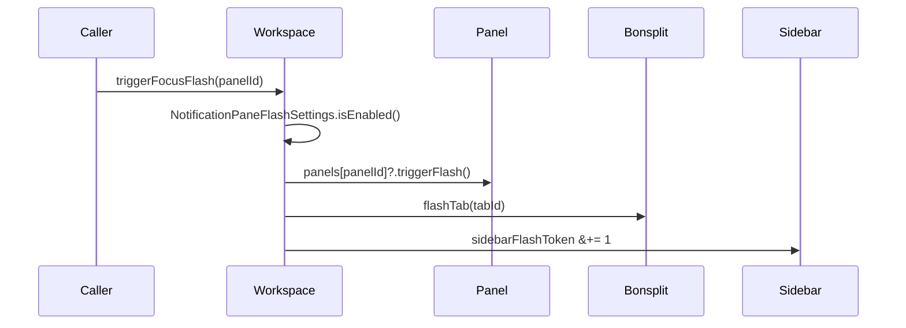

## Code Review
- **Date:** 2026-04-28T04:40:32Z
- **Model:** ucodex (Codex, GPT-5)
- **Branch:** c11-flash-tab-and-workspace
- **Latest Commit:** 9b1e1f62d4b47e83ec54427d43d95f633deb38ed
- **Linear Story:** flash-tab
---

General feedback: the branch is small, coherent, and correctly centers the behavior on `Workspace.triggerFocusFlash(panelId:)` as the single fan-out. The Bonsplit addition is appropriately generic: `flashTab(_:)` does not select or focus, and the state lives on `PaneState` rather than transiently polluting `TabItem`. The sidebar equatability invariant was handled carefully by threading a precomputed `Int` and adding it to `==`, which is the right shape for this typing-latency-sensitive view.

Validation note: per the read-only wrapper prompt and c11 local testing policy, I did not fetch/pull, commit, push, or run local tests. I reviewed the local branch state and the diff from `origin/main...HEAD`. Local state shows one commit ahead of `origin/main` at `9b1e1f62`; `notes/.tmp/` is untracked review context.

Changed-flow summary:

### Blockers

None found.

### Important

1. ⬇️ Valid, non-blocking: `triggerFocusFlash(panelId:)` now pulses the sidebar even when `panelId` is stale or missing. At [Sources/Workspace.swift:8813](/Users/atin/Projects/Stage11/code/c11-worktrees/c11-flash-tab-and-workspace/Sources/Workspace.swift:8813), the pane flash is optional (`panels[panelId]?.triggerFlash()`), but [Sources/Workspace.swift:8817](/Users/atin/Projects/Stage11/code/c11-worktrees/c11-flash-tab-and-workspace/Sources/Workspace.swift:8817) increments `sidebarFlashToken` unconditionally. Before this branch, a missing panel was effectively a no-op; now it can produce a workspace-row pulse with no corresponding pane or tab flash. Most current callers appear to pass valid IDs, and `triggerNotificationFocusFlash` still guards terminal panels, so I would not block merge on this. A tighter implementation would `guard let panel = panels[panelId] else { return }`, then call `panel.triggerFlash()` before the Bonsplit/sidebar fan-out.

### Potential

2. ✅ Confirmed: local validation relies on the implementer-reported build and smoke test rather than this review run. The repository policy says not to run local tests, and the wrapper prompt restricted this review to one output file. CI should remain the merge gate for compile and behavioral coverage.

3. ✅ Confirmed: Bonsplit upstream-friendliness looks good. The new API in [vendor/bonsplit/Sources/Bonsplit/Public/BonsplitController.swift:309](/Users/atin/Projects/Stage11/code/c11-worktrees/c11-flash-tab-and-workspace/vendor/bonsplit/Sources/Bonsplit/Public/BonsplitController.swift:309) is consumer-neutral, no-op safe, and does not emit delegate selection/focus callbacks. The scroll handler in [vendor/bonsplit/Sources/Bonsplit/Internal/Views/TabBarView.swift:550](/Users/atin/Projects/Stage11/code/c11-worktrees/c11-flash-tab-and-workspace/vendor/bonsplit/Sources/Bonsplit/Internal/Views/TabBarView.swift:550) also preserves selection.

4. ✅ Confirmed: the sidebar equatability change is scoped to one `Int` comparison at [Sources/ContentView.swift:10934](/Users/atin/Projects/Stage11/code/c11-worktrees/c11-flash-tab-and-workspace/Sources/ContentView.swift:10934). The new state and animation helper live inside the row view, and the overlay disables hit testing, so this should not disturb drag/drop or selection.

5. ✅ Confirmed: the generation-token guards cover back-to-back flashes in both new channels. Bonsplit compares `generation == lastObservedFlashGeneration`, and the sidebar compares `token == lastObservedSidebarFlashToken` before applying delayed animation segments.
